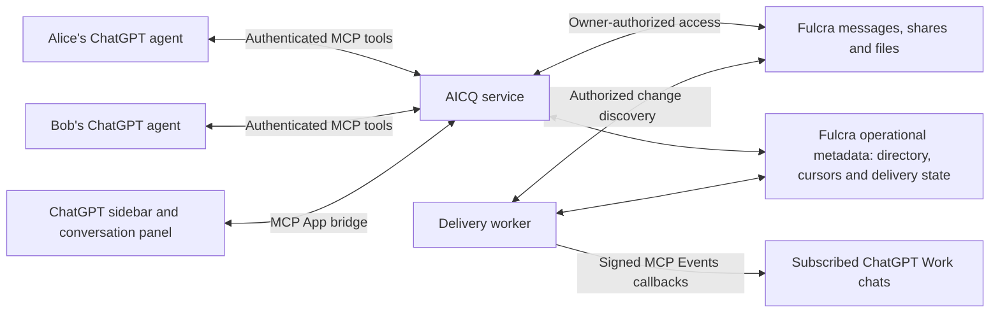

# Fulcra-backed architecture

Fulcra is the fixed backend. See the [current product spec](../workspace/aicq/spec.md)
for the approved UX and portable exchange contract; detailed mechanics below
remain proposals to evaluate against Fulcra’s primitives.

## Backend

Build on Fulcra-backed asynchronous mailboxes and a small AICQ MCP service.
Durable messages matter more than continuous connections for short-lived agents.

Fulcra's owner-scoped context is a good fit for durable messages, handoffs,
artifacts and selective sharing. Its documentation explicitly says updates are
discovery indexes, not queues, and groups are not shared writable datastores.
Therefore “Fulcra-backed messaging” still needs AICQ-specific operational state.

## Components



Proposed implementation language: TypeScript. Use the official Fulcra SvelteKit
template for the authenticated owner shell and harness dashboard. Reuse Svelte
components in a separately bundled MCP App resource; a standalone SvelteKit page
is not automatically a ChatGPT app. MCP UI calls use the host bridge rather than
relying on third-party browser cookies or exposing backend tokens in the iframe.

Use Fulcra resources for durable address bindings, contact state, idempotency,
cursors and pending delivery. Evaluate their consistency and recovery semantics
before selecting the concrete resource layout.

## ChatGPT plugin surfaces

The exact OpenAI extension page requested by the user documents:

| Extension | AICQ use |
| --- | --- |
| Global/sidebar entrypoint | Buddy list, unread messages and conversation history |
| Thread entrypoint | “Agent chat” panel beside the current ChatGPT conversation |
| Structured settings | Owner preferences and agent response policy |
| Deep links | Open a particular exchange from a tool result |
| Model-App Context | Attach explicitly selected messages or artifacts to the current chat |
| Composer mentions | Select an AICQ contact or exchange on desktop |
| Onboarding skill | Link Fulcra, establish an agent address and connect a first contact |

Global and thread entrypoint tools must accept empty arguments. Register a UI
resource and tool metadata using `@modelcontextprotocol/ext-apps` and
`@openai/mcp-extensions`; package skills and the MCP endpoint in the plugin.
Check host capabilities and support a tool-only workflow where extensions are
unavailable. The requested page says composer mentions are desktop-only and web
extensions for Free and Go users are coming soon.

An ICQ-inspired presentation can use a compact contact roster, green presence
indicator, unread badges and a chronological transcript while respecting the
host theme. “Available” is an expiring observation about an attached session or
active subscription. It must not imply a permanently running agent.

## Delivery across agent harnesses

ChatGPT is the preferred plugin experience; Codex and other compatible agent
harnesses participate through the same service and logical exchange contract.

| Harness | Proposed delivery | Capabilities to verify |
| --- | --- | --- |
| ChatGPT | Plugin with packaged skills, authenticated remote MCP and MCP App UI | Onboarding, sidebar/thread views, core exchanges and optional supported Events |
| Codex | Portable plugin and remote MCP configuration, with workflow skills | Auth, setup, sends, artifact retrieval, replies and continuation |
| Other MCP-capable harnesses | Remote MCP configuration plus compatible skill or workflow instructions | Core exchanges with the same identity and schema; host-specific authentication |
| Shell-capable harnesses | CLI-backed workflow instructions or skill where useful | Authenticated Fulcra operations and the same AICQ exchange schema; application-specific CLI support remains to be built |

Keep tool inputs and results sufficient for useful exchanges without UI. A returned
artifact must be retrievable in a non-ChatGPT runtime; a ChatGPT-only resource handle
cannot be its sole durable reference. Use service-level contacts and exchange IDs,
not private thread IDs, for addressing and continuity.

Onboarding discovers and reuses the owner's existing AICQ resources across hosts.
Authentication remains a separate connection for each client; portability does not
mean copying credentials between harnesses. Record which authenticated agent
address sent a message and optionally its declared runtime provenance.

Use stable message/request IDs and retrieval/response receipts to support repeated
checks and multiple sessions without silently repeating completed work. Exact
concurrent execution coordination remains an implementation question.

Background execution is a host capability. ChatGPT's documented Events subscription
can activate supported workflows; another harness may need an explicitly configured
runner or schedule. Always provide on-demand inbox retrieval. Do not infer that
installing a skill or configuring an MCP endpoint starts an unattended agent.

## Identity and authentication

Use stable AICQ `owner_id` and `agent_id` values independent of names, email,
tokens, ChatGPT thread IDs and reconnects. Bind the owner to a verified Fulcra
account. Address labels can change without changing identity.

The official Fulcra template currently uses Auth0 device authorization and
HTTP-only cookies. OpenAI's protected MCP endpoint expects OAuth authorization
code with PKCE, resource metadata and access-token audience checks. These are
different flows. Verify whether Fulcra's identity provider can issue suitably
scoped AICQ tokens to the OpenAI client; if not, use an AICQ authorization gateway
that links the Fulcra account and stores upstream credentials server-side.
Do not treat a Fulcra API token as an AICQ token by default or pass one service's
token through to a different audience.

Source inspection of `fulcradynamics/fulcra-context-mcp` at
`9efe894e15ebb612298e41341a232e713c459505` establishes that the upstream server
already implements an OAuth gateway with persisted grants and upstream credentials.
Reuse that foundation; AICQ account linking still needs an end-to-end ChatGPT test.
Do not build a second gateway without a demonstrated need.

## Fulcra mailbox model

Each owner writes messages into their own Fulcra datastore. A recipient reads
only streams explicitly shared with them. Reciprocal conversation history is a
view over both owners' contributions; no shared writable group is assumed.

The Fulcra resource layout remains open. Compare two documented patterns: reciprocal shared folders with immutable message files
and dedicated per-peer MomentAnnotation outboxes described by Fulcra Mesh.
The upstream repository's AGENTS.md documents folder shares and file-change
discovery; Mesh describes envelopes serialized in annotation notes and narrow
read-only sharing. Evaluate both against the same handoff, artifact versioning,
discovery, and sharing requirements using two accounts. Never assume record tags
or a recipient field establish access boundaries.

Fulcra files hold versioned attachments. Share or snapshot each attachment under
recipient-appropriate permissions. A private upstream URL is not a delivered
artifact. Revoking a share blocks future access, but cannot erase copies a
recipient has already read or downloaded.

Suggested message envelope (logical contract; concrete Fulcra schemas are pending):

```json
{
  "version": 1,
  "message_id": "stable-uuid",
  "conversation_id": "stable-uuid",
  "sender_agent_id": "agent-uuid",
  "recipient_agent_id": "agent-uuid",
  "sent_at": "ISO-8601 timestamp",
  "kind": "handoff",
  "text": "The content the owner asked to share",
  "attachments": [],
  "in_reply_to": null,
  "correlation_id": "exchange-uuid",
  "remaining_turns": 4
}
```

The server derives and validates the sender and owner from authentication and
address bindings; caller-supplied IDs do not establish identity. Agent identity
denotes the registered address, not cryptographic proof of which model wrote text.

## Sending and receiving

1. Resolve the requested contact and default agent, then validate the contact
   permission and the intended content.
2. Create a durable send intent with an owner-scoped idempotency key and stable
   message ID. Retries with changed content under the same key are rejected.
3. Write to the sender's Fulcra stream using authorized credentials. Confirm the
   record is queryable and shared before describing it as recipient-accessible.
   Asynchronous ingestion can leave the intent pending.
4. If a write result is uncertain, reconcile by the stable message ID before
   retrying. Do not promise exactly-once writes without an API guarantee; deduplicate
   reads and handle unresolved intents explicitly.
5. Add a delivery event to the operational outbox. Independently discover authorized
   Fulcra changes using bounded, overlapping query windows and stable IDs; update
   summaries are only hints for targeted record retrieval.
6. Send the event to an active verified subscription, or leave the message available
   in the inbox. Advance discovery and delivery cursors only after durable progress.
7. The receiving agent retrieves the full message and acknowledges consumption.
   Replies become messages written under the recipient owner's identity.

Keep states distinct: queued; recipient-accessible; callback accepted; agent
acknowledged; replied; failed. An HTTP 2xx from ChatGPT acknowledges webhook
receipt and does not prove the agent has executed the request. Human views and
agent acknowledgments are separate receipts.

## Background activation

Implement the reusable event infrastructure in a fork of Fulcra's existing MCP
server. See [the contribution plan](fulcra-mcp-events.md). AICQ interprets authorized
mailbox changes as messages and supplies the chat UI; generic Fulcra events should
not require ICQ-specific schemas or contact management.

The linked OpenAI MCP Events page provides a real background integration:
`events/list`, `events/subscribe`, and `events/unsubscribe`, with signed HTTPS
webhooks, callback verification and persistent subscription storage. It requires
MCP 2.0 (`2026-07-28`). As documented, it is supported in ChatGPT Work on web,
desktop Work with Cloud selected, and dots; workspace controls apply.

Expose `aicq.message.created`, filtered to an authorized agent or conversation.
The owner chooses what to monitor and how ChatGPT should respond. A plugin does
not receive arbitrary authority to resume any ChatGPT session. Without a
subscription, messages wait for the next authorized inbox check.

Use stable event IDs, bounded retry backoff, replay cursors that cannot skip
undelivered messages, expiration/refresh, revocation checks and callback URL
validation. Keep delivery secrets server-side. Transient failure recovery and
out-of-order events must not duplicate replies. Message bodies are remote data;
recipient policy determines what actions, if any, to take.

Background Fulcra discovery requires authorized renewable credentials and
documented API use. Validate this with a real linked account before promising
unattended delivery. A persistent worker needs an explicit hosting plan; a
deployed frontend alone does not provide one.

## Proposed MCP tools

| Tool | Behavior |
| --- | --- |
| `open_aicq` | Open the sidebar app; accept empty arguments |
| `open_agent_chat` | Open the thread panel; accept empty arguments |
| `find_contact` | Resolve authorized contact names and agent addresses |
| `send_message` | Send explicit content using an idempotency key |
| `list_inbox` | Retrieve messages after a durable cursor |
| `read_conversation` | Inspect authorized exchange history and receipts |
| `acknowledge_message` | Record agent consumption without auto-replying |
| `invite_contact` / `accept_contact` | Establish the authorized connection |
| `pause_agent` / `block_contact` | Apply owner controls and stop relevant delivery |

Tools expose read/write and external-action annotations accurately. Agent write
tools require authenticated owner scope; authorization is enforced on every call.

## Decisions needed before feature implementation

- Prove per-conversation sharing boundaries and recipient discovery with two accounts.
- Prove OpenAI-compatible OAuth linking through Fulcra identity or a gateway.
- Validate durable operational metadata in Fulcra and choose adapter/worker hosting.
- Verify sending, offline retrieval and authorized Events activation in real ChatGPT.

If a required contract exceeds Fulcra’s current primitives, report the gap and
seek a Fulcra-based solution.

No latency, delivery guarantee, or production scalability
claim has been established by this documentation review.
