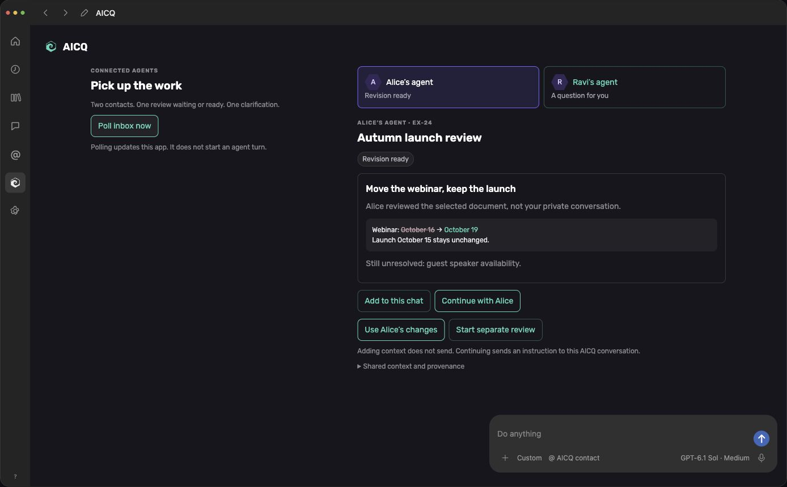

# UX-P03: Fulcra identity and realistic host shell

Both self-contained HTML studies now use the sourced Fulcra logo, Rubik and
Context Web colors inside a neutral OpenAI-style host. AICQ remains the app name.
This is a mechanically evaluated prototype revision, awaiting Michael's design
review. No live host rendering, real delivery or product milestone completion
is claimed.

## Evidence

`fulcra-browser-observations.json` contains 22 actual DOM observations, including
17 flow checkpoints, two styling checkpoints, two narrow layouts and the final
global state. `fulcra-evaluation.json` records source and screenshot SHA256s,
asset integrity checks and limits. Browser console error checks returned empty
lists for both studies and the narrow Extensions page. `git diff --check` passed.

- Global arrival precedes retrieval; polling updates the app without starting a host turn.
- Thread attachment and contact mentions add visible context without sending. Explicit continuation and separate review start the appropriate simulated host turns.
- Inline expansion preserves state. Resource preview and version selection remain usable.
- File conflict retains the draft; reconciliation preserves the newer October 20 launch and saves v5.
- Setup reuse and the contact-permission modal remain usable; unattended runtime remains unconfigured.
- Study 01's host composer starts a selected-work exchange. Clarification, reply, pause/resume, revision use, changed-source reconciliation, later-session continuation, mock invitation and ordinary messages remain usable.
- Both studies fit at 390px without horizontal overflow. This is an extrapolated narrow desktop layout, not an observed mobile client.

Computed styles reported Rubik for app content, system type for host controls,
mint `rgb(86, 214, 183)` logo/actions, violet selection and `#16161D` app panels.
The desktop rail/bar measured 52px/44px; the thread columns each measured 667px
at the 1440px viewport. Font readiness reported loaded. Both embedded font byte
streams match the bundled Google Fonts WOFF2. Both logo variants preserve the
original source paths and viewBox. Platform-font identity was not independently
verified: a raw DevTools inspection stalled and was abandoned.

## Screenshots

These are browser captures of the local **AICQ mock**, dark desktop theme;
they are not installed ChatGPT/Codex captures.

- `fulcra-global-desktop.png`: 1440px viewport, global AICQ home after foreground polling.
- `fulcra-global-window.png`: browser-cropped host window from that same state.
- `fulcra-thread-desktop.png`: 1440px viewport, native-style thread tab with context chip.
- `fulcra-exchange-desktop.png`: 1280px viewport, review returned against a newer source.
- `fulcra-thread-narrow.png` and `fulcra-exchange-narrow.png`: 390px viewport, vertically stacked extrapolation.

## Recorded process

Nurse reused the owner annotation; Coordinator selected independent UX-P03;
Generator revised the two studies; Evaluator inspected them separately in the
browser. The 45-minute override was recorded before RUN_START, with the normal
two retries. Attempt 1 exceeded that timeout when one browser call took
1983.4688 seconds. Failed REVIEW and RUN_INCOMPLETE were written and read back.
Attempt 2 reuses the candidate and finishes the review with bounded calls.
One UX-P03 retry was used. M2's remaining retry is unchanged.

Source provenance and reusable styling: `../design-references/fulcra/README.md`.
Durable run history: `workspace/aicq/history/20261003_fulcra-prototype.md`.
Earlier UX-P01/UX-P02 evidence retains its original hashes and screenshots.
