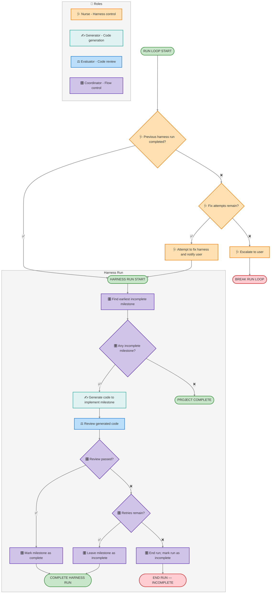

# Harness Control Flow

Lifecycle for the fulcra-app-starter harness. A single **harness run** processes one
milestone; the Nurse re-triggers runs (cron, manual, etc.) to advance the project.

Every milestone requires evaluation of the experience the user will have in the
deployed app. It is how we establish that the work is usable, not merely plausible.
Skipping or inventing that evaluation leaves the job unfinished, even when the
code is written and the deployment succeeds.

Roles:

- 🩺 **Nurse** — monitors and fixes the harness itself: health-check, fix attempts, escalation. The only role that modifies the harness.
- 🎛️ **Coordinator** — operates each harness run (flow control and milestone state), but **cannot modify the harness itself**.
- ✍️ **Generator** — builds the product (typically code) for the current milestone, including a reasonable — not excessive — number of tests.
- ⚖️ **Evaluator** — independently evaluates what the Generator produced for the current milestone: its correctness, its compatibility with previously completed milestones, and its fit with the overall plan and spec. Does **more than run tests** — reads the code and reasons about it against the spec, and tests the product with real tools as well as is viable. 

## Rules

- **No role may modify the spec to make a milestone pass.** The spec is fixed for the harness. If a milestone cannot be satisfied as specified, the Nurse escalates to the user; only the user's response can change the spec (escalation is the sole path to a spec change).
- Only the Nurse modifies the harness. The Coordinator, Generator, and Evaluator operate within it.
- The Evaluator must not pass a review based on reading the code alone. You must provide concrete evidence of exercising the newly built functionality using real tool execution on a "live" version of the app, or through another reliable verification method. Never record a REVIEW as completed without tool output proving the feature works end-to-end. To test functionality of a live app:
  1. Start the local development server (e.g., `npm run dev`) in the background.
  2. Obtain the current user's access token by running `uvx fulcra-api auth print-access-token`.
  3. Use `curl` to hit the back-end endpoints directly. Since the template apps use cookie-based authentication, pass the token as a cookie: `curl --cookie "fulcra_access_token=<TOKEN>" http://localhost:5173/api/...`
  4. If a browser automation tool (like `browser_exec`) is available in your environment, use it to drive and verify the UI.
- Evidence makes the evaluation inspectable; it is not a substitute for performing it. Every event's `evidence` string records actions actually taken and facts observed so far. For `REVIEW` completed, report the successful evaluations actually performed: commands or UI actions, tested URL/revision, expected behavior, and observed results covering the milestone and relevant regressions. A build, code inspection, or authenticated API request alone cannot prove a user journey such as browser sign-in. Exercise sign-in through the callback and authenticated UI when establishing or changing authentication. If tools, credentials, or any required check are unavailable, record the blocker in a failed REVIEW and keep the milestone incomplete; follow retry/escalation rules. The Coordinator must inspect the evidence before recording `MARK_COMPLETE`; missing, vague, or incomplete evidence is not a passing review.
- **Two retries per milestone and two harness-fix attempts (three tries each).** After a failed review, the Coordinator retries the milestone on subsequent runs up to two more times — three attempts total — before ending the run as incomplete. The Nurse attempts to fix a broken harness up to two more times (three tries total) before escalating to the user.
- **15-minute timeout per milestone run.** A run that exceeds 15 minutes is stopped and counts as a failed attempt (consuming a retry).

These retry and timeout values are defaults; the user or agent may change them. plan.md must include a **Harness** section stating that the product is built and iterated through harness runs, linking to this file ([`harness-control-flow.md`](harness-control-flow.md)), and recording the current harness configuration — the retry counts, the per-run timeout, and any other harness settings — including any overrides the user or agent introduces.



## Tracking System

The harness tracks progress using two mechanisms:

1. **Custom Annotation** — Append-only log of run events (step starts, completions, errors)
2. **Workspace Files** — Persistent state (overview.md, progress.md, outstanding-issues.md)

The custom annotation enables the harness dashboard to show live run status. Workspace files enable resume capability, issue tracking, and the dashboard's human-readable overview.

## Setup

The harness starts before app implementation, not after the dashboard is built.
M1 is the working baseline and harness dashboard; later milestones add features.
The Nurse bootstraps only the run mechanism and event storage before M1. During
M1 the Nurse implements harness/dashboard machinery, the Generator implements
the baseline app, and the Evaluator checks both. Keep these responsibilities
separate even when one agent takes the roles sequentially.

Before the first run, check `progress.md` for an existing annotation ID. Reuse
it on resume. If absent, the Nurse creates a custom data type to
hold run events. Use `MomentAnnotation` as the base type — it stores a free-form
`note` (where we pack each run event as JSON) plus a timestamp:

```bash
uvx fulcra-api data-type create MomentAnnotation "Harness Runs: <project-name>"
```

The create response's `id` is a UUID; form `MomentAnnotation/<UUID>` from it.
Save that full data type ID in `progress.md`, together with run state and retry
counts. It becomes `PUBLIC_HARNESS_ANNOTATION_ID` in the Svelte dashboard
(`NEXT_PUBLIC_HARNESS_ANNOTATION_ID` in the React dashboard). Do not create a
second annotation when wiring the UI: it must display the records from M1.

Mint the first `run_id`, health-check event storage and workspace access, then
record and read back `RUN_START` before implementation. Record `FIND_MILESTONE`
and `GENERATE` transitions as the work happens. The dashboard does not need to
exist to record these events. Initialize `overview.md` and
`outstanding-issues.md` before evaluating their dashboard panels. If recording
or workspace access fails, use Nurse repair/escalation, not an untracked build.

## Recording Run Events

Write records at key points in the flow with `fulcra-api record`. Pack the event
fields (`run_id`, `step`, `status`, `detail`, `evidence`) into the `note` as a JSON string;
the record's timestamp is set automatically:

```bash
printf '%s\n' '{"note":"{\"run_id\":\"<run-id>\",\"step\":\"RUN_START\",\"status\":\"started\",\"detail\":\"Starting M1: working baseline and harness dashboard\",\"evidence\":\"<actual health-check actions and observed results>\"}"}' \
  | uvx fulcra-api record "MomentAnnotation/<UUID>"
```

Replace the placeholders before running. Use explicit JSON stdin (as above),
or save the same outer JSON record to a file and run
`uvx fulcra-api record "MomentAnnotation/<UUID>" --file event.json`.
For generated detail and evidence text, use a JSON serializer twice: serialize the event to
the `note` string, then serialize the outer record. Do not interpolate arbitrary
text into shell quoting.

**Do not use `--note` for these events.** In CLI 0.1.42, non-interactive empty
stdin produces `Error: No input provided` even with field options. Also,
`--note='{"run_id":...}'` is parsed as an object, not the string required by
MomentAnnotation. Piped/file JSON avoids both problems without disabling schema
validation.

The dashboard reads `recorded_at` for timing and JSON-parses the string `note`.
The timestamp defaults to now when omitted. The JSON shapes below are outer
records; replace their placeholder timestamps with real ISO-8601 timestamps or
omit `recorded_at` to use the default.

During the first harness run, the Evaluator verifies actual record writing as
part of [M1 dashboard evaluation](harness-dashboard-setup.md#evaluate-m1-before-handoff).
Use `uvx fulcra-api get-records "MomentAnnotation/<UUID>" "1h"` to read back a
real run event and verify its `run_id`, step, status, and parseable string `note`.
Ingestion can be asynchronous: poll within the run's timeout, without blindly
resubmitting duplicate events. An upload receipt alone is not read-back proof.
Verify that same event through the dashboard's backend and UI. No separate test
annotation or recurring command-verification procedure is needed. Never record
completions ahead of the work merely to populate the dashboard.

### Evidence contract

`detail` is a short status summary; `evidence` is a required non-empty plain-text
string explaining what was done and found, not a plan or a restatement of the
status. Started events describe actual setup/observations so far, never future
successes. Failed events include the attempted check, observed failure, and any
checks blocked or not performed. Completed events substantiate their outcome.
Include concise factual results inline and workspace paths for longer output;
links alone are not evidence. Never include tokens, cookies, passwords, or
private user data. Replace every evidence placeholder below with real findings
before recording; never copy hypothetical successful results into a run.

### Run Start

```json
{
  "note": "{\"run_id\": \"<unique-run-id>\", \"step\": \"RUN_START\", \"status\": \"started\", \"detail\": \"Starting harness run\", \"evidence\": \"<actual health-check actions and observed results>\"}",
  "recorded_at": "<ISO-8601>"
}
```

### Step Transitions
Write records when each step starts and completes:

**Step Start:**
```json
{
  "note": "{\"run_id\": \"<run-id>\", \"step\": \"<STEP_NAME>\", \"status\": \"started\", \"detail\": \"\", \"evidence\": \"<actual setup actions and observations so far>\"}",
  "recorded_at": "<ISO-8601>"
}
```

**Step Complete:**
```json
{
  "note": "{\"run_id\": \"<run-id>\", \"step\": \"<STEP_NAME>\", \"status\": \"completed\", \"detail\": \"<result-summary>\", \"evidence\": \"<actions actually performed and observed results supporting completion>\"}",
  "recorded_at": "<ISO-8601>"
}
```

**Step Failed:**
```json
{
  "note": "{\"run_id\": \"<run-id>\", \"step\": \"<STEP_NAME>\", \"status\": \"failed\", \"detail\": \"<error-message>\", \"evidence\": \"<attempted check, actual failure output, and checks not performed>\"}",
  "recorded_at": "<ISO-8601>"
}
```

### Progress Updates (long-running steps)

`FIX_ATTEMPT`, `GENERATE`, and `REVIEW` can each run for a long time. To keep the
dashboard live while they run, emit an extra progress record for the currently
running step every few minutes — reuse `status: "started"` and update `detail`
with what is happening now:

```json
{
  "note": "{\"run_id\": \"<run-id>\", \"step\": \"<STEP_NAME>\", \"status\": \"started\", \"detail\": \"<progress-summary>\", \"evidence\": \"<actions and findings accumulated so far>\"}",
  "recorded_at": "<ISO-8601>"
}
```

Keep these coarse — every few minutes, not every action — so a run accumulates a
handful of progress records, not hundreds. The dashboard keeps the newest record
per step, so each update must carry forward relevant evidence gathered so far.
The step box shows the latest `detail` and `evidence` and switches to
`status: "completed"` (or `"failed"`) when you write that step's final record.

### Key Steps to Track

- `FIND_MILESTONE` — Coordinator finding next incomplete milestone
- `GENERATE` — Generator writing code
- `REVIEW` — Evaluator reviewing code  
- `MARK_COMPLETE` — Coordinator marking milestone complete
- `ESCALATE` — Nurse escalating to user
- `FIX_ATTEMPT` — Nurse attempting fix
- `RUN_COMPLETE` — Run finished successfully
- `RUN_INCOMPLETE` — Run ended without completion

### Run IDs and terminal steps

The dashboard groups records by `run_id` and infers which branch of the flow a
run took from the steps present, so record them consistently:

- **Mint a new `run_id`** at the top of each run-loop iteration, before the
  Nurse health-check. Record the Nurse's `FIX_ATTEMPT` or `ESCALATE` under that
  new `run_id` — the dashboard treats them as the start of the run they precede.
  An escalation writes only an `ESCALATE` record for that new `run_id` (no
  harness run follows); the dashboard shows it as an "escalated" run.
- When a review fails but **retries remain**, the run leaves the milestone
  incomplete yet still ends with **`RUN_COMPLETE`** (flow: *Leave milestone
  incomplete → COMPLETE HARNESS RUN*). Use **`RUN_INCOMPLETE`** only when retries
  are **exhausted** (*End run → END RUN — INCOMPLETE*). The dashboard uses this
  distinction to show "Retry Next Run" versus "End Run — Incomplete".
- When no incomplete milestone remains, still write a `FIND_MILESTONE` record
  (with no `GENERATE` after it) so the dashboard renders "Project Complete".

## Workspace Updates

### overview.md

The Nurse rewrites `workspace/<project-name>/overview.md` on **every loop** — a
concise, human-readable summary the dashboard renders at the top as styled
markdown. It is a snapshot, not a log: overwrite it each loop rather than
appending. Keep it short (it is a summary, not progress.md) and cover:

- **Overall status** — one line on whether the project is on track, and what the
  harness is doing right now.
- **Milestone list** — every milestone with its state (complete / in progress /
  pending). A checklist with emoji reads well in the dashboard.
- **Recent activity** — a sentence or two on what the last run(s) accomplished
  and any blockers.

Because the dashboard renders it as markdown, the Nurse can style it with
headings, bold, lists, and links. Example:

```markdown
# Project Overview

**Status:** On track — 3 of 7 milestones complete. Currently generating code for
Milestone 4.

## Milestones

- ✅ **M1 — Auth & user shell** — complete
- 🔄 **M4 — Leaderboard API** — in progress
- ⬜ **M5 — Sharing** — pending

## Recent activity

Last run completed the entry-logging milestone after one review retry. No
outstanding blockers.
```

Write it with `fulcra-api file upload`:

```bash
uvx fulcra-api file upload overview.md "workspace/<project-name>/overview.md"
```

### outstanding-issues.md

Update `workspace/<project-name>/outstanding-issues.md` when issues occur:

**On Escalation:**
Add issue with timestamp, run ID, and description. Include what the user needs to do.

**On Resolution:**
Remove or mark resolved when user addresses the issue or a subsequent run succeeds.

**Format:**
```markdown
# Outstanding Issues

## [ISO-8601 timestamp] - Run <run-id>

**Issue:** <description>
**Action Needed:** <what user should do>

---

## [timestamp] - Run <older-run-id> [RESOLVED]

**Issue:** <description>
**Resolution:** <how it was resolved>
```

### progress.md

Update `workspace/<project-name>/progress.md` after each harness run (see workspace.md for full structure). Include:
- Harness State section with current run status, retry count, last run timestamp
- Active Milestone
- Recent Completions (when milestones complete)
