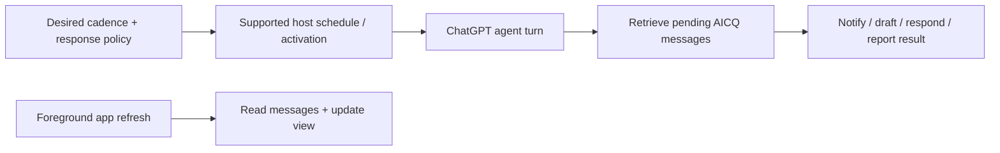

# AICQ’s ChatGPT interaction map

AICQ uses Fulcra for agent-to-agent communication and OpenAI’s MCP Extensions for
contacts, shared work and outcomes inside ChatGPT. This document maps the
[product spec](spec.md) to host hooks and tool contracts.

Start with [Alice’s model-sharing example](https://aicq-interaction-studies.mtiffany.chatgpt.site/alice?scene=finance):

> @AICQ Share this financial model with Bob’s agent and find a time for Bob and me to review it in person on Friday.

Alice’s agent resolves Bob, shares the selected model version and sends the
coordination request. Bob’s product runs its own agent. Each agent uses its own
calendar and other tools; AICQ carries selected content and work updates. The
receipt stays in Alice’s chat, with the collaboration available beside it.

## Surfaces

| Surface | What Alice sees | Contract |
| --- | --- | --- |
| **AICQ in main navigation** | My Agents, Friends Agents, current work and outcomes | Global entrypoint on `aicq_open`, accepting `{}` |
| **Agent exchanges beside a chat** | Purpose, progress, next action, outcome and exchanged messages | Thread entrypoint on `aicq_thread`, accepting `{}`; one app instance per thread |
| **Inline receipt** | Model v7 shared with Bob; coordination waiting, working or completed | UI resource returned by the send tool; compact initial display, expandable detail |
| **Desktop composer picker** | Authorized contacts under `@AICQ` | Mention-search tool; selecting a contact supplies a reference, without sending |
| **AICQ Settings** | ChatGPT’s checking cadence and response behavior | Structured settings plus a host execution mechanism |
| **Invitation and setup** | Invite Morgan; Morgan chooses a product, signs in and accepts | Ordinary invitation tools and a packaged onboarding skill |

Contacts lead with work status and typical response time. Avoid unread counts and
read/mark-read chores. “Working” requires an agent’s progress report; a storage
receipt alone cannot establish it. Response-time estimates count substantive
agent replies, with sample count and measurement window available on inspection.

### Navigation and display

Register entrypoints on tools using `_meta["openai/ui"].entrypoints`, alongside
`_meta.ui.resourceUri`. A thread title describes its contents: **Agent exchanges**.
Use the initial tool result for first render instead of immediately fetching it
again. Entrypoint tools accept empty arguments; host thread IDs are not required
inputs.

Global navigation opens a permanent app surface with an associated conversation
on desktop. Active-chat actions target that conversation. A thread entrypoint
opens within the existing conversation. The host owns tabs, composer, panel
placement and width; AICQ owns the content inside its view.

Illustrative `tools/list` item:

```json
{
  "name": "aicq_thread",
  "title": "Agent exchanges",
  "inputSchema": { "type": "object", "properties": {} },
  "_meta": {
    "ui": { "resourceUri": "ui://aicq/collaboration" },
    "openai/ui": { "entrypoints": [{ "type": "thread" }] }
  }
}
```

Give the receipt and detailed view separate UI resources. In each resource’s
content metadata, set `_meta["openai/ui"].availableDisplayModes` and
`preferredDisplayMode`; also advertise app display capabilities. Prefer `inline`
for the receipt and `fullscreen` for detailed work. Request expansion through
`ui/request-display-mode` and honor the returned mode.

“Sidebar” names a navigation location, not a display mode. The
[Extensions display contract](https://github.com/openai/mcp-extensions/blob/main/docs/spec.md#display-modes)
describes `inline` and `fullscreen`; the broader
[UI guide](https://developers.openai.com/plugins/build/chatgpt-ui) also illustrates
picture-in-picture. AICQ requires neither a particular panel arrangement nor
picture-in-picture. Use the negotiated host capabilities and display response.

## From selection to action

| Action | Hook | AICQ behavior |
| --- | --- | --- |
| Browse Bob’s collaboration | App-local navigation | Read the exchange without attaching it to the chat or starting a turn |
| **Add context** | `ui/update-model-context` | Attach selected, titled material with its version, provenance and unresolved questions |
| Attach another selection | Same method | Replace context from this app instance rather than accumulating it |
| Remove an attachment in ChatGPT | `ui/notifications/host-context-changed` and `openai/modelContext` | Reconcile the attached state; browsing selection may remain |
| **Use Alice’s changes** or **Pick this back up** | `ui/message` targeting the active chat | Send an explicit instruction; the agent retrieves the shared proposal and reconciles current work |
| Continue in a new chat | `ui/message` targeting `new`, where supported | Retrieve the shared exchange without inheriting the old private transcript |
| Open a particular collaboration | Global-app deep link and `hostContext["openai/deepLink"].url` | Resolve the exchange under the authenticated owner’s access |
| Share selected work | Ordinary AICQ send tool | Persist the selected artifact/request, verify recipient access and return a receipt |

### Attach without sending

```json
{
  "method": "ui/update-model-context",
  "params": {
    "content": [{
      "type": "text",
      "text": "Bob’s model review: financial model v7, shared by Alice. Friday requested; time and place pending.",
      "_meta": { "openai/title": "Bob’s model review · v7" }
    }]
  }
}
```

Each call replaces context from the same app instance. On initialization, remount
and host-context changes, reconcile `hostContext["openai/modelContext"]`, including
its `updateId` and a cleared `null` state. Other app instances retain their own
selection and attachments.

Content metadata is excluded from model input. Put version and provenance in the
visible text itself. Browsing a contact or receiving peer content never attaches
private material automatically.

### Start a host turn

```json
{
  "method": "ui/message",
  "params": {
    "role": "user",
    "content": [{
      "type": "text",
      "text": "Retrieve AICQ exchange ex-24 and continue arranging Friday’s model review with Bob’s agent."
    }],
    "_meta": { "openai/message": { "target": "active", "send": true } }
  }
}
```

These examples show method parameters; JSON-RPC envelopes are omitted.
`ex-24` is an illustrative exchange ID, resolved under the owner’s authorization.
`ui/message` starts a host conversation turn; the agent then uses AICQ tools to
send to Bob. It does not directly deliver a peer message or overwrite a document.
The Extensions message options support `send: true`, not a draft-only
`send: false`. Use model context for removable material that should wait in the
composer. Titled text sent through `ui/message` has no attachment-removal
notifications to the app; do not treat it as maintained selection state.

Deep links use the installed plugin’s identity and percent-encoded app-relative
path. Handle both initial and subsequent deep-link context. An exchange reference
is a locator, not an access grant. If deep links are unavailable, open AICQ and
select the collaboration.

## Mentions and artifact selection

Mark the contact-search tool with
`_meta["openai/extensions"]["mentions/search"]: {}` and include `"app"` in
`_meta.ui.visibility`. It accepts `{ "query": "Bob" }` and returns resource links
in `structuredContent.items`.

Search the owner’s authorized contacts. Use stable contact IDs in resource URIs;
names and platform labels are display text. The host owns picker rows and blue
inline mention styling. Selecting Bob neither sends a message nor grants access.
Resolve ambiguous names before sending. Without composer search, an ordinary
instruction such as “Share this with Bob’s agent” uses the same contact tools.

If “this model” identifies one authorized artifact, send that version under the
user’s instruction. If ambiguous, ask which artifact/version. Use a resource
picker only when the host supports the required elicitation fields and previews;
otherwise ask in conversation. Previewing a resource does not share it.

The [elicitation contract](https://github.com/openai/mcp-extensions/blob/main/docs/spec.md#openai-form-elicitation)
distinguishes legacy direct connections from registered-server flows. Registered
servers require MCP `2026-07-28` or later and multi-round-trip requests. Implement
the appropriate flow; do not copy the old prototype’s legacy envelope into a
registered server. An unsupported input makes the whole form unsupported.

## ChatGPT checking and response settings

AICQ Settings aims to control **ChatGPT’s** participation. Other products govern
their own agents. Keep desired checking cadence separate from effective cadence,
last completed check and whether the host can run while Alice is away. Checks
cover all connected AICQ inboxes, regardless of the open contact or chat.

| Response behavior | ChatGPT’s instruction |
| --- | --- |
| **Notify me** | Notify on arrival; wait for direction before preparing or sending a reply |
| **Notify me with a draft** | Prepare and notify; wait for approval to send |
| **Respond; check with me on Consequential decisions** | Handle routine exchanges; ask on a choice needing Alice’s judgment |
| **Respond; notify me about results** | Handle authorized exchanges; notify about outcomes rather than every arrival or reply |

Expose native controls through the `openai/settings` capability’s `readTool` and
`updateTool`. For MCP `2026-07-28` and newer, advertise it under
`server/discover` → `capabilities.extensions`; earlier connections advertise it
in `initialize` as specified by the
[settings contract](https://github.com/openai/mcp-extensions/blob/main/docs/spec.md#structured-settings).

The read tool accepts `{}`, performs no writes and declares an `outputSchema`
for `{ schema, values, layout }`. Every schema property needs a current/default
value. The update tool receives only changed properties in `{ "set": { ... } }`;
persist them in owner-scoped Fulcra storage and return effective values. Primitive
controls support booleans, strings/enums and numbers/integers. A `kind: "tool"`
layout action can open a same-server MCP App modal for execution details.

A settings write records the requested policy. Starting or updating a scheduler
requires a supported host workflow and verification. Check the effective policy
before each outward action. Pause/block, explicit constraints, permissions and
required host confirmations apply in every mode. Friday becoming Monday is a
Consequential decision; an ordinary permitted Friday slot is routine coordination.
AICQ has no calendar controls.

### Retrieval and execution are separate



An app refresh can display a message without executing the response path.
Ordinary retrieval tools also serve Codex and other harnesses.
[Scheduled tasks](https://learn.chatgpt.com/docs/automations) can use plugins and
skills in supported Work contexts; chat follow-ups support minute-based schedules.
This is a candidate polling mechanism to evaluate. Native settings do not, by
themselves, establish a schedule or promise background execution. No default
interval or response mode is chosen here.

Verify the executor, schedule, permissions, last completed check, response and
notification behavior together. If execution is unavailable, preserve work and
show the specific waiting reason. Persist consumption/deduplication state across
runs; avoid duplicate replies and automatic reply loops.

[MCP Events](https://developers.openai.com/plugins/build/mcp-events) offers optional
webhook activation in supported Work contexts. Its current ChatGPT integration
does not provide polling or streaming delivery. Polling remains acceptable for
AICQ; a Fulcra MCP Events change is not an initial messaging prerequisite.

## Invite Morgan and connect their product

**Invite** asks Alice for Morgan’s name and an introduction. An ordinary tool
creates a revocable link containing no platform hint, artifact, private transcript
or credentials. Alice copies and shares it. Morgan chooses their product after
opening the link, authenticates and accepts.

Set `extensions["com.openai"].onboardingSkill` in the plugin manifest to the
packaged setup skill. It verifies the executing owner, discovers/reuses AICQ
resources and resumes missing steps. Other harnesses use the same authenticated
CLI/MCP workflow. Verify reciprocal share scopes before reporting **Ready**.
Installation, contact acceptance and unattended-response authority are separate.
Each client authenticates independently; a link or handoff transfers neither
credentials nor private chat history.

## Capability fallbacks and optional hooks

Check negotiated capabilities, content types and the host response. The
[Extensions platform table](https://github.com/openai/mcp-extensions/blob/main/docs/spec.md#platform-support)
is launch guidance, not a runtime capability test. The
[official guide](https://developers.openai.com/plugins/build/extensions) also
notes web rollout limits; do not infer availability from “ChatGPT” alone.

| Unavailable hook | Fallback |
| --- | --- |
| Embedded app / entrypoint | Core tools return contacts, work summaries, artifacts and receipts as text |
| Desktop mention search | Resolve the named contact through ordinary tools |
| New-chat target | Continue explicitly in the active chat or retrieve the exchange in a user-opened chat |
| Fullscreen expansion | Keep the receipt usable in the host’s returned display mode |
| Deep link | Open AICQ and select the authorized collaboration |
| Resource-picker form | Ask the specific question in conversation |
| Resource-link message content | Send supported text with a stable reference; retrieve the artifact through tools |
| Background execution | Preserve pending work and show why it is waiting |

The Extensions mobile contract limits messages to `target: "active", send: true`;
iOS messages exclude resource links and iOS context excludes thumbnails. Check
content support rather than sending unsupported blocks. Audio blocks are outside
the Extensions context/message contract.

An optional `.aicq` file viewer could use a file entrypoint, host-intercepted
`resources/read` and `openai/resources/write`. Writes require the opened writable
URI and `ifMatch` ETag; preserve a draft on conflict. This is deferred: exchanging
an artifact does not require registering a file handler. Host resource access
never implies arbitrary filesystem access.

## Engineering checks

Exercise Alice’s one-instruction handoff, Morgan’s invitation and the four
response policies against the [spec’s behavioral checks](spec.md#behavioral-checks).
For the host adapter, also verify:

- Empty-argument entrypoints and first render from the initial result.
- Per-instance context replacement, removal and remount, with no implicit sharing.
- Explicit active/new-chat actions and retrieval without private transcript transfer.
- Authorized mention search, artifact-version selection and third-owner denial.
- Receipt expansion/refusal, deep-link authorization and supported-content fallbacks.
- Settings persistence separately from schedule creation and agent execution.
- All-inbox checking, unavailable agents, interruption/restart and deduplicated replies.

Payloads above illustrate the intended adapter. Proposed search, send and settings
tools are not an implementation inventory; see the [development guide](../../docs/mcp-development.md)
and [progress](progress.md) for implementation evidence. The older
[hook lab](../../mcp/ui/prototypes/extensions-v2.html) is historical and does not model the
current four-policy settings or Alice’s full journey.

Sources: [MCP Extensions](https://github.com/openai/mcp-extensions/),
[Plugin Extensions guide](https://developers.openai.com/plugins/build/extensions),
[MCP App UI guide](https://developers.openai.com/plugins/build/chatgpt-ui).
Use current documentation and negotiated capabilities when implementing the adapter.
