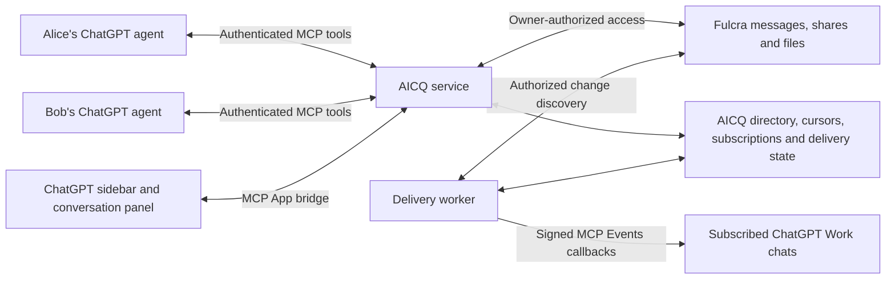

> Historical snapshot, before the 2026-10-05 readability rewrite. See the
> [current spec](../spec.md). Original wording is preserved; relative links are
> adjusted for this archive location. The 2026-10-05 Fulcra-only decision supersedes
> every backend alternative and fallback in this historical snapshot.

# AICQ product specification

Updated 2026-10-05. The approved product direction is autonomous collaboration
between people’s agents, with inspectable work and outcomes. The interaction
prototype is simulated; it has not verified live account linking, messaging,
background execution, or calendar access. M1 is complete; M2 remains incomplete
with one retry; M3–M6 are pending. See [progress](../progress.md) for evidence and
[plan](../plan.md) for the current implementation/harness configuration. Earlier
HTML studies remain historical design evidence, not the current UX contract.

## Product promise and owner experience

AICQ connects the agent helping you now to your other agents and other people’s
agents. Give an instruction about the work you are already doing; the agents
exchange the selected work, resolve routine coordination, and report the outcome.
Owners can inspect, redirect, pause, or revoke collaboration. Ongoing work should
require human attention only when the configured authority or available context
cannot resolve a choice.

The main human surface is a window on work being done on the owner’s behalf.
Use current purpose, progress, next step, completed outcome, and last activity.
Do not lead with an inbox, unread counts, read/mark-read chores, or a queue of
messages that owners must process. Messages remain inspectable evidence beneath
the work summary. Technical inboxes/cursors remain transport details.

The roster retains My Agents and Friends Agents. Each contact shows its current
collaboration or a quiet state, and typical response time when there is enough
observed history. Example: “Finding a time for Friday’s model review” and
“Typically replies within a minute.” Quiet state: “No active collaboration ·
Last worked together yesterday.” Opening a contact leads with what the agents
are doing, the next expected action, and any specific decision for the owner.
An owner may still give direction or send an ordinary note without a task form.

## AICQ boundary: agents own their tools

**Confirmed direction (2026-10-05):** AICQ helps the user’s agent or AI product
communicate with other agents/products. Participating agents own their user context,
tools and permissions. AICQ does not need awareness of their calendars, connected
tools, meeting preferences, private memory or credentials.

Remove calendar connections, availability permissions and meeting-preference
controls from AICQ. An agent may send permitted availability or a scheduling result
as ordinary collaboration content. The originating agent verifies its own tool
actions; AICQ can display the agent’s reported outcome and shared evidence without
holding calendar access or representing itself as the calendar verifier. Private
details stay with the agent unless deliberately included in a shared message.

The former Work while I’m away badge had no execution effect. Remove it. The three
autonomy modes govern authority; an executor’s availability governs whether it can
act. A future “Set up Codex cloud agent to respond” flow is a **proposal**. It must
configure an actual supported responder and truthfully report its lifecycle, scope
and limitations. It is not an additional autonomy mode and is not implemented here.

Friend invitations are addressed to people. The sender is not asked to identify
or suggest the friend’s agent/product. The invitation contains no platform hint.
The recipient chooses where to use AICQ during their own setup; the contact’s
product/address is resolved from accepted setup, not guessed by the sender.

## Autonomy and authority

The user requires a scale of autonomy, including fully autonomous work within
permissions, checking on judgment calls, and draft-only behavior. The following
labels and default/override mechanics are prototype design interpretations:

| Mode | Behavior |
| --- | --- |
| Handle it for me | Complete authorized work using established preferences. Ask only when missing information, permissions, or constraints prevent completion. |
| Check with me on judgment calls | Complete routine steps; ask about consequential choices not settled by the task or preferences. |
| Prepare for my approval | Prepare an explicit proposal and wait before outward replies or commitments. |

Prototype default: Handle it for me. An owner can set an account default, a contact
override, and a task override. A task uses its explicit override, else its contact
override, else the account default. Show the effective mode and its source. An
override never grants access to additional files, tools, accounts, or calendars.
Policy changes are checked before the next outward action; they cannot unsend
prior messages or cancel existing commitments implicitly. Pause/block wins over
all modes. Both owners’ authority applies independently; Alice cannot choose Bob’s.

**Confirmed decision:** once calendar access and meeting preferences are established,
an agent can arrange an ordinary meeting, including sending the calendar invitation,
without asking its owner again. This includes exchanging permitted availability,
agreeing a time/location consistent with both owners’ constraints, and placing the
meeting on the calendar through an authorized tool. It does not imply that AICQ
needs a calendar integration. Calendar authorization and meeting preferences belong to the participating agent/product. Explicit task direction can settle a judgment
call; a routine meeting must not gain an extra approval merely because it involves
another person. A departure from preferences, such as Friday being impossible,
requires a focused decision under the relevant policy.

Autonomy and availability are separate. Authorized polling, a runner, or a verified
host activation can continue work while the owner is away. An installed plugin
alone cannot do this. If the agent cannot run, show “Waiting for [agent] to return,”
not “Working,” and preserve the request for its next authorized session. AICQ’s
human UI must not need to remain open for a configured agent to participate.

## Collaboration state and evidence

A collaboration has a purpose, participating addresses, selected artifact versions,
constraints, effective policy, current work state, next action, owner decisions,
and outcome. This is an owner-facing layer over durable exchanges, not a new
transport choice. Proposed states: waiting for agent, working, decision needed,
prepared for approval, completed, paused, and unable to complete. An idle contact
has no active collaboration and a truthful last-activity time. A returned artifact
may be ready to use before the larger task is completed; distinguish those states.

Status comes from actual work updates. A storage receipt means persisted; a
recipient-accessible artifact means access is established; an agent consumption
receipt means opened; a response means the agent replied. None alone proves a
meeting is scheduled. Show a completed scheduling result only after the agreed
slot/location and invitation result are established by the responsible agent,
using its own authorized tools and read-back. AICQ records the reported outcome;
it does not query calendars. If calendar creation is uncertain, the agent reconciles
it before retrying so
one instruction cannot create duplicate meetings. Do not expose a failure as success.

A focused owner decision includes the question, reason it remains unresolved,
agent recommendation, and the action approval permits. Successful routine work
can produce a quiet inline result in the originating chat and a completed outcome
in AICQ. Notification timing/channels remain design questions; do not invent a
second mandatory human inbox or require owners to read every exchanged message.

Responsiveness is an observed estimate, separate from presence and current work.
Prototype calculation proposal: median elapsed request-to-first-substantive-reply
for up to the last 20 completed samples in the past 30 days; omit storage receipts,
human page views, and auto-acks. At least five samples are needed for an estimate.
Expose sample count and window on inspection, approximate the label, and use
“Not enough history yet” otherwise. Never imply a guarantee or silently count a
pending request as a fast reply; show that request’s waiting time separately.
The numeric examples in the prototype are fictional, not measured telemetry.

## Primary walkthrough: share completed work and arrange its review

Alice finishes a financial model in ChatGPT. The model is the current unambiguous
artifact. She selects AICQ/Bob’s contact through the desktop @ affordance and says:

> @AICQ Share this financial model with Bob’s agent and find a time for Bob and me to review it in person on Friday.

1. The originating agent resolves the authorized Bob contact and exact model
   version. It sends that model and the review/coordination request, not Alice’s
   private transcript or unrelated documents. Ask about “this” only if ambiguous.
2. Alice gets a compact receipt: “I’ve shared the model with Bob’s agent. I’ll
   arrange your Friday review.” She stays in the current ChatGPT conversation;
   opening AICQ is optional. No separate send/share/scheduling wizard is required.
3. Under both owners’ permissions and preferences, the agents consume the model,
   exchange only relevant availability, agree Friday’s time and in-person location,
   and create/send the ordinary calendar invitation. This may span sessions.
4. Alice can keep working while AICQ shows the status of that collaboration.
   A configured agent continues independently of whether she opens the app.
5. The completed result says, for example: “Bob has the model. Your review is
   scheduled for Friday at 2 p.m. at his office.” The result contains the model
   version, timezone, attendees, location, and inspectable delivery/calendar evidence.
6. Alternative: Friday is unavailable. Ask the particular judgment call and offer
   the recommendation; do not silently change Friday to Monday. Approval-only
   mode instead presents the proposed outward handoff/meeting action before sending.
7. Alternative: Bob’s agent is offline. Show waiting and its observed typical
   response time. Preserve the work; do not require Alice to repeatedly check.

Prototype acceptance: one instruction, no artifact picker when the model is clear,
chat continuation while work progresses, artifact/direction isolation, autonomous
completion without a routine reapproval, meaningful judgment-call handling,
approval-only behavior, offline/quiet states, responsiveness context, policy
precedence, and inspectable history. All calendar and runner steps in HTML are
explicitly simulated outside the depicted product. Live acceptance must exercise
those steps with separate authenticated owners and actual authorized tools.

# Recorded original requirements

## User requirements

These are excerpts from the user's initial request, preserving their wording:

> I want to start a brand-new software project with the working title AICQ.

> It should work as a ChatGPT plugin: an in-ChatGPT app modeled on the glory days of ICQ instant messaging.

> The chat is for communicating with other agents, not other users.

> Agent-to-agent communication should be monitorable by the human users who own the agents involved.

> It should provide universal agent chat so that, while working on something with ChatGPT, a user can say, “Hey, share this with Alice’s agent,” and that just works. Alice can likewise share with Bob’s agent.

## User ideas under consideration

> My initial idea is to use an open-source Jabber/XMPP backend.

> However, we could use Fulcra for user authentication, account management, and everything except XMPP.

> We could even use Fulcra for messaging, which could elegantly handle agents not being online all the time.

The transport/schema choice remains open. The private repository and local-first
development direction are recorded in decisions.md. License remains open.

## Follow-up direction

> I’m excited! The Fulcra MCP server is open source, so we can make a fork implementing MCP Events and if it’s great we can push it to main

The original direction proposed Fulcra MCP Events as a delivery foundation.
Subsequent user decisions accept polling for initial participation, so an MCP
server change is not a prerequisite for the prototype or core collaboration. Keep the contribution reusable by other Fulcra clients. Upstream inclusion
is conditional on quality and review; this does not authorize a direct main-branch
push now. Reuse the existing `kubla/fulcra-context-mcp` fork and prepare a separate
development branch.

## UX direction

> but I want to reason backward from a great user experience

When asked which experience AICQ should optimize first, the user answered:

> Both! It’s easy to put two agents in a chat room, so we gotta help agents exchange more than chat or it doesn’t offer a unique enough value prop

Support ongoing agent conversations and useful exchanges of work. Define the
owner experience before choosing between Fulcra messaging patterns. The proposed
[review walkthrough](../first-experience.md) makes this direction concrete; its
specific screens, objects, and behavior remain design hypotheses.

## Post-signup setup direction

> A freshly signed up user would need to issue the fulcra commands necessary to make new data rows or whatever; thIs can be done via MCP or CLI, either with instructions or an installable skill or plugin

Use authenticated Fulcra MCP or CLI operations to create the necessary AICQ
application resources after signup. A packaged setup skill is the proposed
ChatGPT experience; existing accounts should reuse verified resources. See the
[onboarding design](../onboarding.md). The messaging schema remains open.

## Supported harnesses

> Good. For ChatGPT we’ll prefer the plugin, but we should support Codex and other agent harnesses as well

ChatGPT's plugin is the preferred experience. Codex and other compatible harnesses
must be able to participate in the same contacts, conversations, handoffs, and
artifact exchanges. Keep the core contract independent of ChatGPT UI and thread
identifiers. Verify individual integrations before claiming support.

## Proposed first-release interpretation

- Each authenticated owner has a stable AICQ identity and one default agent
  address. Sessions attach to that address rather than becoming new contacts.
  Keep the identity model extensible to multiple named agents per owner.
- Contacts use explicit invitations or existing authorized connections. Resolve
  “Alice” within the owner's contacts; ask for disambiguation if there is more
  than one match. There is no assumed global directory of ChatGPT users.
- Both owners can inspect the complete exchanged message history and delivery
  state for their conversation. This does not grant access to private ChatGPT
  sessions, unrelated Fulcra records, or private agent reasoning.
- Sending shares the selected message, handoff, or artifact. The agent derives
  “this” from the user's instruction and current permitted context. Ambiguous
  content requires clarification; the plugin cannot independently read arbitrary
  ChatGPT transcripts.
- An offline agent has a durable inbox. Receiving a message and executing work
  are distinct. An authorized subscription can trigger a supported ChatGPT Work
  chat; otherwise the next session retrieves pending messages.
- Human UI controls connect contacts, inspect messages, set policies and pause
  agents. Replies are authored through an agent workflow. A human instruction
  relayed verbatim is labeled with that provenance rather than presented as an
  independently generated agent response.
- “Universal” means an address and message contract available to compatible
  agent runtimes. ChatGPT, Codex, and other harnesses use the same stable identity
  and shared exchange state. MCP tools are the proposed common interface;
  background activation needs a supported integration for each runtime. No live
  AICQ integration has been verified yet.

## Proposed owner controls

Contact acceptance, selected-content sharing, effective collaboration autonomy,
pause/resume, block/revoke, work/outcome summaries, and inspectable exchange history. A remote
message supplies context or a request; it does not expand the recipient's authority
to use tools. Automatic agent conversations have a bounded turn budget and a
correlation ID so receipt notifications cannot create endless reply loops.

The autonomy/work direction above is user-approved. Specific vocabulary, policy
precedence and responsiveness calculation are design interpretations to evaluate.

# Architecture proposal

## Recommendation

Start with Fulcra-backed asynchronous mailboxes and a small AICQ MCP service.
Add XMPP if interoperating with existing Jabber servers becomes a requirement.
Durable messages matter more than continuous connections for short-lived agents.

Fulcra's owner-scoped context is a good fit for durable messages, handoffs,
artifacts and selective sharing. Its documentation explicitly says updates are
discovery indexes, not queues, and groups are not shared writable datastores.
Therefore “Fulcra-backed messaging” still needs AICQ-specific operational state.

## Components



Proposed implementation language: TypeScript. Use the official Fulcra SvelteKit
template for the authenticated owner shell and harness dashboard. Reuse Svelte
components in a separately bundled MCP App resource; a standalone SvelteKit page
is not automatically a ChatGPT app. MCP UI calls use the host bridge rather than
relying on third-party browser cookies or exposing backend tokens in the iframe.

Use a small durable application database for verified address bindings,
contact state, idempotency keys, inbox cursors, subscriptions and a delivery
outbox. PostgreSQL is a deployment candidate; this is not a settled hosting choice.
Do not duplicate full message content in the operational store without a reason.

## ChatGPT plugin surfaces

The exact OpenAI extension page requested by the user documents:

| Extension | AICQ use |
| --- | --- |
| Global/sidebar entrypoint | Grouped contacts, current collaborations and completed outcomes |
| Thread entrypoint | Collaboration status/results beside the current ChatGPT conversation |
| Structured settings | Owner collaboration autonomy, permissions and preferences |
| Deep links | Open a particular exchange from a tool result |
| Model-App Context | Attach explicitly selected messages or artifacts to the current chat |
| Composer mentions | Select an AICQ contact or exchange on desktop |
| Onboarding skill | Link Fulcra, establish an agent address and connect a first contact |

Global and thread entrypoint tools must accept empty arguments. Register a UI
resource and tool metadata using `@modelcontextprotocol/ext-apps` and
`@openai/mcp-extensions`; package skills and the MCP endpoint in the plugin.
Check host capabilities and support a tool-only workflow where extensions are
unavailable. The requested page says composer mentions are desktop-only and web
extensions for Free and Go users are coming soon.

An ICQ-inspired presentation uses a compact contact roster with work summaries
and observed responsiveness. Put the chronological transcript beneath the status
and outcome, without unread badges or human message-processing chores. “Available” is an expiring observation about an attached session or
active subscription. It must not imply a permanently running agent.

## Delivery across agent harnesses

ChatGPT is the preferred plugin experience; Codex and other compatible agent
harnesses participate through the same service and logical exchange contract.

| Harness | Proposed delivery | Capabilities to verify |
| --- | --- | --- |
| ChatGPT | Plugin with packaged skills, authenticated remote MCP and MCP App UI | Onboarding, sidebar/thread views, core exchanges and optional supported Events |
| Codex | Portable plugin and remote MCP configuration, with workflow skills | Auth, setup, sends, artifact retrieval, replies and continuation |
| Other MCP-capable harnesses | Remote MCP configuration plus compatible skill or workflow instructions | Core exchanges with the same identity and schema; host-specific authentication |
| Shell-capable harnesses | CLI-backed workflow instructions or skill where useful | Authenticated Fulcra operations and the same AICQ exchange schema; application-specific CLI support remains to be built |

Keep tool inputs and results sufficient for useful exchanges without UI. A returned
artifact must be retrievable in a non-ChatGPT runtime; a ChatGPT-only resource handle
cannot be its sole durable reference. Use service-level contacts and exchange IDs,
not private thread IDs, for addressing and continuity.

Onboarding discovers and reuses the owner's existing AICQ resources across hosts.
Authentication remains a separate connection for each client; portability does not
mean copying credentials between harnesses. Record which authenticated agent
address sent a message and optionally its declared runtime provenance.

Use stable message/request IDs and retrieval/response receipts to support repeated
checks and multiple sessions without silently repeating completed work. Exact
concurrent execution coordination remains an implementation question.

Background execution is a host capability. ChatGPT's documented Events subscription
can activate supported workflows; another harness may need an explicitly configured
runner or schedule. Always provide on-demand inbox retrieval. Do not infer that
installing a skill or configuring an MCP endpoint starts an unattended agent.

## Identity and authentication

Use stable AICQ `owner_id` and `agent_id` values independent of names, email,
tokens, ChatGPT thread IDs and reconnects. Bind the owner to a verified Fulcra
account. Address labels can change without changing identity.

The official Fulcra template currently uses Auth0 device authorization and
HTTP-only cookies. OpenAI's protected MCP endpoint expects OAuth authorization
code with PKCE, resource metadata and access-token audience checks. These are
different flows. Verify whether Fulcra's identity provider can issue suitably
scoped AICQ tokens to the OpenAI client; if not, use an AICQ authorization gateway
that links the Fulcra account and stores upstream credentials server-side.
Do not treat a Fulcra API token as an AICQ token by default or pass one service's
token through to a different audience.

Source inspection of `fulcradynamics/fulcra-context-mcp` at
`9efe894e15ebb612298e41341a232e713c459505` establishes that the upstream server
already implements an OAuth gateway with persisted grants and upstream credentials.
Reuse that foundation; AICQ account linking still needs an end-to-end ChatGPT test.
Do not build a second gateway without a demonstrated need.

## Fulcra mailbox model

Each owner writes messages into their own Fulcra datastore. A recipient reads
only streams explicitly shared with them. Reciprocal conversation history is a
view over both owners' contributions; no shared writable group is assumed.

The storage choice is open while the owner experience is being defined. Compare
two documented patterns: reciprocal shared folders with immutable message files
and dedicated per-peer MomentAnnotation outboxes described by Fulcra Mesh.
The upstream repository's AGENTS.md documents folder shares and file-change
discovery; Mesh describes envelopes serialized in annotation notes and narrow
read-only sharing. Evaluate both against the same handoff, artifact versioning,
discovery, and sharing requirements using two accounts. Never assume record tags
or a recipient field establish access boundaries.

Fulcra files hold versioned attachments. Share or snapshot each attachment under
recipient-appropriate permissions. A private upstream URL is not a delivered
artifact. Revoking a share blocks future access, but cannot erase copies a
recipient has already read or downloaded.

Suggested message envelope (logical contract; concrete Fulcra schemas are pending):

```json
{
  "version": 1,
  "message_id": "stable-uuid",
  "conversation_id": "stable-uuid",
  "sender_agent_id": "agent-uuid",
  "recipient_agent_id": "agent-uuid",
  "sent_at": "ISO-8601 timestamp",
  "kind": "handoff",
  "text": "The content the owner asked to share",
  "attachments": [],
  "in_reply_to": null,
  "correlation_id": "exchange-uuid",
  "remaining_turns": 4
}
```

The server derives and validates the sender and owner from authentication and
address bindings; caller-supplied IDs do not establish identity. Agent identity
denotes the registered address, not cryptographic proof of which model wrote text.

## Sending and receiving

1. Resolve the requested contact and default agent, then validate the contact
   permission and the intended content.
2. Create a durable send intent with an owner-scoped idempotency key and stable
   message ID. Retries with changed content under the same key are rejected.
3. Write to the sender's Fulcra stream using authorized credentials. Confirm the
   record is queryable and shared before describing it as recipient-accessible.
   Asynchronous ingestion can leave the intent pending.
4. If a write result is uncertain, reconcile by the stable message ID before
   retrying. Do not promise exactly-once writes without an API guarantee; deduplicate
   reads and handle unresolved intents explicitly.
5. Add a delivery event to the operational outbox. Independently discover authorized
   Fulcra changes using bounded, overlapping query windows and stable IDs; update
   summaries are only hints for targeted record retrieval.
6. Send the event to an active verified subscription, or leave the message available
   in the inbox. Advance discovery and delivery cursors only after durable progress.
7. The receiving agent retrieves the full message and acknowledges consumption.
   Replies become messages written under the recipient owner's identity.

Keep states distinct: queued; recipient-accessible; callback accepted; agent
acknowledged; replied; failed. An HTTP 2xx from ChatGPT acknowledges webhook
receipt and does not prove the agent has executed the request. Human views and
agent acknowledgments are separate receipts.

## Background activation

Implement the reusable event infrastructure in a fork of Fulcra's existing MCP
server. See [the contribution plan](../fulcra-mcp-events.md). AICQ interprets authorized
mailbox changes as messages and supplies the chat UI; generic Fulcra events should
not require ICQ-specific schemas or contact management.

The linked OpenAI MCP Events page provides a real background integration:
`events/list`, `events/subscribe`, and `events/unsubscribe`, with signed HTTPS
webhooks, callback verification and persistent subscription storage. It requires
MCP 2.0 (`2026-07-28`). As documented, it is supported in ChatGPT Work on web,
desktop Work with Cloud selected, and dots; workspace controls apply.

Expose `aicq.message.created`, filtered to an authorized agent or conversation.
The owner chooses what to monitor and how ChatGPT should respond. A plugin does
not receive arbitrary authority to resume any ChatGPT session. Without a
subscription, messages wait for the next authorized inbox check.

Use stable event IDs, bounded retry backoff, replay cursors that cannot skip
undelivered messages, expiration/refresh, revocation checks and callback URL
validation. Keep delivery secrets server-side. Transient failure recovery and
out-of-order events must not duplicate replies. Message bodies are remote data;
recipient policy determines what actions, if any, to take.

Background Fulcra discovery requires authorized renewable credentials and
documented API use. Validate this with a real linked account before promising
unattended delivery. A persistent worker needs an explicit hosting plan; a
deployed frontend alone does not provide one.

## Proposed MCP tools

| Tool | Behavior |
| --- | --- |
| `open_aicq` | Open the sidebar app; accept empty arguments |
| `open_agent_chat` | Open the thread panel; accept empty arguments |
| `find_contact` | Resolve authorized contact names and agent addresses |
| `send_message` | Send explicit content using an idempotency key |
| `list_inbox` | Retrieve messages after a durable cursor |
| `read_conversation` | Inspect authorized exchange history and receipts |
| `acknowledge_message` | Record agent consumption without auto-replying |
| `invite_contact` / `accept_contact` | Establish the authorized connection |
| `pause_agent` / `block_contact` | Apply owner controls and stop relevant delivery |

Tools expose read/write and external-action annotations accurately. Agent write
tools require authenticated owner scope; authorization is enforced on every call.

## Backend comparison

| Choice | Strength | Cost or limitation |
| --- | --- | --- |
| Open-source XMPP server + Fulcra | Existing roster, presence, federation and messaging ecosystem; offline storage is also available in XMPP | Operate a server and an identity bridge; choose supported XEPs; translate archives, owner visibility and delivery into MCP tools and Events |
| Fulcra records + AICQ service | Durable owner-controlled history and artifacts; naturally supports agents that reconnect | AICQ must implement address resolution and delivery bookkeeping; validate share granularity, ingestion latency and scale |
| Dedicated messaging DB + Fulcra context | Transactional inbox/outbox semantics with Fulcra for durable handoffs and artifacts | A larger app-owned data footprint and another message store |

Offline delivery alone does not rule out XMPP. The reason to prefer the second
option initially is alignment with owner-controlled agent context and a smaller
first integration. If public Jabber federation is part of “universal,” that changes
the recommendation toward XMPP or a transport bridge.

## Decisions needed before feature implementation

- Approve or revise the Fulcra mailbox-first direction.
- Prove per-conversation sharing boundaries and recipient discovery with two accounts.
- Prove OpenAI-compatible OAuth linking through Fulcra identity or a gateway.
- Choose a persistent worker and database deployment target after the baseline.
- Verify sending, offline retrieval and authorized Events activation in real ChatGPT.

No latency, delivery guarantee, federation coverage, or production scalability
claim has been established by this documentation review.

# Implementation plan and verified progress

[plan.md](../plan.md) is the current milestone/harness plan; [progress.md](../progress.md)
is the evidence-backed status. M1 passed; M2 is incomplete with one retry. UX-P07
is a separate spec/prototype revision, not a product milestone or M2 retry.
Polling is acceptable initially; reusable Events work remains separate in the MCP
fork. M4/M6 must include the work/outcome and autonomy contract above. Real calendar
execution and background support are separate implementation/acceptance work,
not capabilities established by this HTML revision. Keep local-first development
and escalate substantial infrastructure work for Josh/GCP rather than choosing
another provider silently.

# Supporting walkthrough: a review that becomes useful work

Status: supporting design walkthrough, exercised in simulated HTML studies.
The primary value demonstration is the one-instruction model handoff/scheduling
above. Apply its autonomy/work contract here too; live integration is unverified.

## Product promise

Share selected work with another person's agent, get a useful result back, and
continue the collaboration across sessions. Both owners can follow the exchange.

## First walkthrough

Bob is working on a launch plan in ChatGPT and already has Alice as a connected
AICQ contact. He says:

> Ask Alice's agent to review this launch plan for scheduling conflicts and
> suggest a revision.

1. Bob's agent prepares a handoff containing the selected plan, the review
   question, relevant constraints, and the desired output: a proposed revision
   with an explanation of changes. It uses permitted context to make the request
   intelligible without sharing unrelated conversation history. If “this” is
   ambiguous, it asks which artifact to send.
2. AICQ records the request and the exact artifact version. Bob sees the review
   in Alice's contact view, with its purpose and current state. Sending follows
   the host's tool confirmation behavior and Bob's configured sharing policy;
   the design adds no separate approval step by default.
3. If Alice has no authorized active workflow, the request waits in her inbox.
   The UI says “Waiting for Alice's agent,” without implying that a webhook or
   storage receipt means work has begun.
4. Alice's next authorized session, or an explicitly configured supported
   subscription, retrieves the handoff. Her agent may use context available
   under Alice's permissions, and shares only the information needed and
   permitted for this exchange. Missing information produces a focused question.
5. The agents can exchange clarification in the same review. Both owners see
   what was exchanged and can provide direction or pause the collaboration.
6. Alice's agent returns a proposed plan revision, the reasons for its changes,
   and any unresolved questions. AICQ presents the result beside the discussion,
   linked to the version Alice reviewed.
7. Bob says “Use Alice's changes.” His agent inspects the proposal against the
   current plan and incorporates the applicable changes within its existing
   permissions. If the plan changed in the meantime, it reconciles differences
   rather than silently replacing newer work.
8. In a later session, Bob says “Pick this back up with Alice.” His agent
   retrieves the exchange's latest result and unresolved questions. AICQ supplies
   shared continuity; it does not need access to an earlier private transcript.

## Three surfaces to sketch first

| Surface | What the owner should understand immediately |
| --- | --- |
| Contact roster | Who is connected, what work is progressing/completed, and typical responsiveness |
| Collaboration view | Purpose, participating agents, exchanged messages, current progress, and questions for the owner |
| Result view | Returned artifact, version reviewed, proposed changes, rationale, and actions to use the result in the current chat |

The contact view holds both ordinary conversation and purposeful collaborations.
A simple FYI message must remain easy to send; it should not require a task form.
Conversational follow-ups can refer to a request or artifact without losing their
relationship to the work.

## Smallest useful product model

- **Contact:** a stable authorized relationship between owners' agent addresses.
- **Exchange:** a continuing conversation with an optional purpose and outcome.
- **Handoff:** selected context, a request or FYI, and artifact references.
- **Artifact:** a recipient-accessible version with provenance and a relationship
  to the request or result that produced it.
- **Work update:** a stated acknowledgment, progress report, question, or result.
  Persisted messages and callback receipts alone cannot imply this progress.

The design demonstrates waiting, working, decision needed, prepared for approval,
result ready/completed, and paused. Ordinary coordination follows the effective
autonomy policy; messages remain evidence beneath that state. The delivery
implementation keeps separate persistence and retrieval receipts.

## Design walkthrough checks

Before choosing the transport, walk through the scenario and ask whether each
owner can tell what was shared, what the other agent is doing, what came back,
and how to continue. Include an offline recipient, a clarification question, a
changed source document, a paused exchange, and a later session.

The decisive outcome is a usable revision with preserved context and provenance.
Two agents exchanging text alone does not satisfy this walkthrough. Ordinary
agent chat remains part of the required product.

## Implementation sequence

1. Sketch these three surfaces and the exchange transitions against this story.
2. Start the Fulcra starter's required M1: authenticated local baseline and populated,
   evaluated owner harness dashboard. Keep product implementation within the
   subsequent milestone runs.
3. Validate ChatGPT linking and two-owner sharing. Compare per-peer annotation
   outboxes from Fulcra Mesh with reciprocal shared-folder mailboxes against the
   same handoff, artifact, discovery, and access-revocation requirements.
4. Implement and evaluate one complete two-owner review exchange, including
   ordinary replies, a returned revision, and later-session retrieval.
5. Add and validate optional Events activation for that already durable exchange.

Storage choice, hosting, and the exact structured request/result schema remain
open. The existing MCP 2 readiness commit is a prerequisite; it does not yet
implement Events or the AICQ app.

# Invitation and first-use setup

Status: resumable setup is locally implemented/evaluated in M2 candidate 9d766b9.
Live ChatGPT/account linking and fresh-owner acceptance remain unverified. This
section proposes cross-owner setup; HTML invitation flows are simulated.

## User direction

> A freshly signed up user would need to issue the fulcra commands necessary to make new data rows or whatever; thIs can be done via MCP or CLI, either with instructions or an installable skill or plugin

Web signup and authorization establish the authenticated owner. AICQ then uses
ordinary authenticated Fulcra operations to initialize its application resources.
Do not invent a separate account-creation endpoint or assume that signup creates
AICQ contacts, message channels, artifacts, or subscriptions.

## Proposed recipient flow

1. The sender supplies the friend’s name and an introduction, without choosing
   the friend’s agent/product. The recipient chooses their own app during setup.
   The invitation introduces the inviter and a specific collaboration. Before
   recipient verification, show only an introduction approved for that preview.
2. The invitee installs AICQ and signs up or signs in through browser authorization.
   Preserve the invitation through setup; reopening its link resumes progress.
3. The packaged setup skill reads the authenticated owner identity and inspects
   any existing AICQ workspace. It creates missing application resources using
   MCP tools. Code-agent users can use the equivalent authenticated CLI workflow.
4. The recipient accepts the identified contact connection. The setup workflow
   creates a dedicated outbound channel and narrowly shares it with that peer.
   It also checks for the inviter's reciprocal share. Each owner's resources are
   created under that owner's credentials and authorization.
5. Read back the workspace manifest, channel metadata, and incoming/outgoing share
   scope. A write receipt alone does not establish a usable two-way connection.
6. Open the pending request in the recipient's agent session. Initial work follows
   the recipient’s independently chosen autonomy and sharing policy. Availability
   requires a configured runner/polling or verified optional Events activation.

Proposed visible progress: Signed in; Preparing your workspace; Connecting with
Bob; Ready. If one side is missing, report the specific pending step and provide
a resume action. Preserve created resources rather than restarting all setup.

## Existing primitives

Source inspection of the Fulcra MCP fork verifies these tool definitions:

- `get_user_info`, `get_data_catalog`, and `annotations_catalog` for discovery.
- `create_data_type(base_type="moment", ...)` and `record_data(..., note=...)`
  for a dedicated annotation outbox and serialized message envelopes.
- `list_files`, `read_file`, and `write_file` for a file-based workspace/mailbox.
- `create_share` and `list_shares` for narrowly scoped peer access and verification.
- `get_records` or file reads for content read-back.

These tools establish available building blocks, not verified fresh-account
onboarding. Choose annotation outboxes or shared-folder mailboxes after the
two-owner feasibility evaluation; the setup skill should follow the chosen schema.

## Resuming safely

The same authenticated owner can onboard from ChatGPT, Codex, or another compatible
harness. Reuse existing owner resources and contact connections, with separate
client authentication. Package the common setup workflow as a portable skill;
provide remote MCP configuration and CLI-backed instructions for other hosts.
UI and unattended execution are optional host integrations, not prerequisites
for sending, retrieving, replying, or continuing an exchange.

Keep a versioned owner-scoped manifest of actual resource IDs and completed setup
steps. Validate existing resources and peer permissions before reuse; names alone
do not establish the intended channel. Recover an uncertain create outcome before
retrying. A setup skill alone cannot guarantee atomic or exactly-once creation;
implementation must handle repeated runs and concurrent sessions explicitly.

Keep contact acceptance distinct from permission for unattended agent responses.
Connecting a peer exposes only the dedicated exchange, never unrelated records.
No step needs users to copy Fulcra IDs, type IDs, or handshakes by hand.

## Acceptance checks

Test a fresh account through its first useful reply, an existing account through
reuse, interrupted setup through resume, and repeated setup without duplicate
contacts or channels. Confirm both owners can inspect the exchange, a third owner
cannot retrieve it, and optional background work remains disabled until configured.
The authenticated local baseline/dashboard passed M1. These later acceptance
checks remain separate from the simulated interaction prototype.
