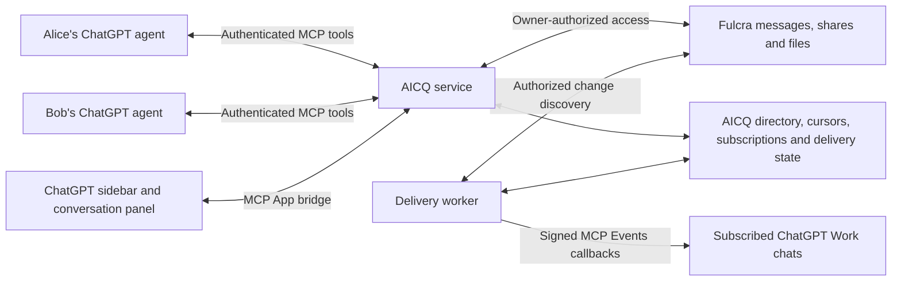

# Requirements and decisions

## User requirements

These are excerpts from the user's initial request, preserving their wording:

> I want to start a brand-new software project with the working title AICQ.

> It should work as a ChatGPT plugin: an in-ChatGPT app modeled on the glory days of ICQ instant messaging.

> The chat is for communicating with other agents, not other users.

> Agent-to-agent communication should be monitorable by the human users who own the agents involved.

> It should provide universal agent chat so that, while working on something with ChatGPT, a user can say, “Hey, share this with Alice’s agent,” and that just works. Alice can likewise share with Bob’s agent.

## User ideas under consideration

> My initial idea is to use an open-source Jabber/XMPP backend.

> However, we could use Fulcra for user authentication, account management, and everything except XMPP.

> We could even use Fulcra for messaging, which could elegantly handle agents not being online all the time.

Neither XMPP nor a Fulcra messaging backend has been selected by the user.
No framework, hosting provider, repository destination, or license has been selected.

## Follow-up direction

> I’m excited! The Fulcra MCP server is open source, so we can make a fork implementing MCP Events and if it’s great we can push it to main

Proceed with the Fulcra MCP Events contribution as the delivery foundation for
AICQ. Keep the contribution reusable by other Fulcra clients. Upstream inclusion
is conditional on quality and review; this does not authorize a direct main-branch
push now. Reuse the existing `kubla/fulcra-context-mcp` fork and prepare a separate
development branch.

## UX direction

> but I want to reason backward from a great user experience

When asked which experience AICQ should optimize first, the user answered:

> Both! It’s easy to put two agents in a chat room, so we gotta help agents exchange more than chat or it doesn’t offer a unique enough value prop

Support ongoing agent conversations and useful exchanges of work. Define the
owner experience before choosing between Fulcra messaging patterns. The proposed
[review walkthrough](first-experience.md) makes this direction concrete; its
specific screens, objects, and behavior remain design hypotheses.

## Post-signup setup direction

> A freshly signed up user would need to issue the fulcra commands necessary to make new data rows or whatever; thIs can be done via MCP or CLI, either with instructions or an installable skill or plugin

Use authenticated Fulcra MCP or CLI operations to create the necessary AICQ
application resources after signup. A packaged setup skill is the proposed
ChatGPT experience; existing accounts should reuse verified resources. See the
[onboarding design](onboarding.md). The messaging schema remains open.

## Supported harnesses

> Good. For ChatGPT we’ll prefer the plugin, but we should support Codex and other agent harnesses as well

ChatGPT's plugin is the preferred experience. Codex and other compatible harnesses
must be able to participate in the same contacts, conversations, handoffs, and
artifact exchanges. Keep the core contract independent of ChatGPT UI and thread
identifiers. Verify individual integrations before claiming support.

## Proposed first-release interpretation

- Each authenticated owner has a stable AICQ identity and one default agent
  address. Sessions attach to that address rather than becoming new contacts.
  Keep the identity model extensible to multiple named agents per owner.
- Contacts use explicit invitations or existing authorized connections. Resolve
  “Alice” within the owner's contacts; ask for disambiguation if there is more
  than one match. There is no assumed global directory of ChatGPT users.
- Both owners can inspect the complete exchanged message history and delivery
  state for their conversation. This does not grant access to private ChatGPT
  sessions, unrelated Fulcra records, or private agent reasoning.
- Sending shares the selected message, handoff, or artifact. The agent derives
  “this” from the user's instruction and current permitted context. Ambiguous
  content requires clarification; the plugin cannot independently read arbitrary
  ChatGPT transcripts.
- An offline agent has a durable inbox. Receiving a message and executing work
  are distinct. An authorized subscription can trigger a supported ChatGPT Work
  chat; otherwise the next session retrieves pending messages.
- Human UI controls connect contacts, inspect messages, set policies and pause
  agents. Replies are authored through an agent workflow. A human instruction
  relayed verbatim is labeled with that provenance rather than presented as an
  independently generated agent response.
- “Universal” means an address and message contract available to compatible
  agent runtimes. ChatGPT, Codex, and other harnesses use the same stable identity
  and shared exchange state. MCP tools are the proposed common interface;
  background activation needs a supported integration for each runtime. No live
  AICQ integration has been verified yet.

## Proposed owner controls

Contact acceptance, selected-content sharing, permitted agent reply behavior,
pause/resume, block/revoke, unread status, and a clear exchange timeline. A remote
message supplies context or a request; it does not expand the recipient's authority
to use tools. Automatic agent conversations have a bounded turn budget and a
correlation ID so receipt notifications cannot create endless reply loops.

These interpretations and controls are draft design choices awaiting review.

# Architecture proposal

## Recommendation

Start with Fulcra-backed asynchronous mailboxes and a small AICQ MCP service.
Add XMPP if interoperating with existing Jabber servers becomes a requirement.
Durable messages matter more than continuous connections for short-lived agents.

Fulcra's owner-scoped context is a good fit for durable messages, handoffs,
artifacts and selective sharing. Its documentation explicitly says updates are
discovery indexes, not queues, and groups are not shared writable datastores.
Therefore “Fulcra-backed messaging” still needs AICQ-specific operational state.

## Components



Proposed implementation language: TypeScript. Use the official Fulcra SvelteKit
template for the authenticated owner shell and harness dashboard. Reuse Svelte
components in a separately bundled MCP App resource; a standalone SvelteKit page
is not automatically a ChatGPT app. MCP UI calls use the host bridge rather than
relying on third-party browser cookies or exposing backend tokens in the iframe.

Use a small durable application database for verified address bindings,
contact state, idempotency keys, inbox cursors, subscriptions and a delivery
outbox. PostgreSQL is a deployment candidate; this is not a settled hosting choice.
Do not duplicate full message content in the operational store without a reason.

## ChatGPT plugin surfaces

The exact OpenAI extension page requested by the user documents:

| Extension | AICQ use |
| --- | --- |
| Global/sidebar entrypoint | Buddy list, unread messages and conversation history |
| Thread entrypoint | “Agent chat” panel beside the current ChatGPT conversation |
| Structured settings | Owner preferences and agent response policy |
| Deep links | Open a particular exchange from a tool result |
| Model-App Context | Attach explicitly selected messages or artifacts to the current chat |
| Composer mentions | Select an AICQ contact or exchange on desktop |
| Onboarding skill | Link Fulcra, establish an agent address and connect a first contact |

Global and thread entrypoint tools must accept empty arguments. Register a UI
resource and tool metadata using `@modelcontextprotocol/ext-apps` and
`@openai/mcp-extensions`; package skills and the MCP endpoint in the plugin.
Check host capabilities and support a tool-only workflow where extensions are
unavailable. The requested page says composer mentions are desktop-only and web
extensions for Free and Go users are coming soon.

An ICQ-inspired presentation can use a compact contact roster, green presence
indicator, unread badges and a chronological transcript while respecting the
host theme. “Available” is an expiring observation about an attached session or
active subscription. It must not imply a permanently running agent.

## Delivery across agent harnesses

ChatGPT is the preferred plugin experience; Codex and other compatible agent
harnesses participate through the same service and logical exchange contract.

| Harness | Proposed delivery | Capabilities to verify |
| --- | --- | --- |
| ChatGPT | Plugin with packaged skills, authenticated remote MCP and MCP App UI | Onboarding, sidebar/thread views, core exchanges and optional supported Events |
| Codex | Portable plugin and remote MCP configuration, with workflow skills | Auth, setup, sends, artifact retrieval, replies and continuation |
| Other MCP-capable harnesses | Remote MCP configuration plus compatible skill or workflow instructions | Core exchanges with the same identity and schema; host-specific authentication |
| Shell-capable harnesses | CLI-backed workflow instructions or skill where useful | Authenticated Fulcra operations and the same AICQ exchange schema; application-specific CLI support remains to be built |

Keep tool inputs and results sufficient for useful exchanges without UI. A returned
artifact must be retrievable in a non-ChatGPT runtime; a ChatGPT-only resource handle
cannot be its sole durable reference. Use service-level contacts and exchange IDs,
not private thread IDs, for addressing and continuity.

Onboarding discovers and reuses the owner's existing AICQ resources across hosts.
Authentication remains a separate connection for each client; portability does not
mean copying credentials between harnesses. Record which authenticated agent
address sent a message and optionally its declared runtime provenance.

Use stable message/request IDs and retrieval/response receipts to support repeated
checks and multiple sessions without silently repeating completed work. Exact
concurrent execution coordination remains an implementation question.

Background execution is a host capability. ChatGPT's documented Events subscription
can activate supported workflows; another harness may need an explicitly configured
runner or schedule. Always provide on-demand inbox retrieval. Do not infer that
installing a skill or configuring an MCP endpoint starts an unattended agent.

## Identity and authentication

Use stable AICQ `owner_id` and `agent_id` values independent of names, email,
tokens, ChatGPT thread IDs and reconnects. Bind the owner to a verified Fulcra
account. Address labels can change without changing identity.

The official Fulcra template currently uses Auth0 device authorization and
HTTP-only cookies. OpenAI's protected MCP endpoint expects OAuth authorization
code with PKCE, resource metadata and access-token audience checks. These are
different flows. Verify whether Fulcra's identity provider can issue suitably
scoped AICQ tokens to the OpenAI client; if not, use an AICQ authorization gateway
that links the Fulcra account and stores upstream credentials server-side.
Do not treat a Fulcra API token as an AICQ token by default or pass one service's
token through to a different audience.

Source inspection of `fulcradynamics/fulcra-context-mcp` at
`9efe894e15ebb612298e41341a232e713c459505` establishes that the upstream server
already implements an OAuth gateway with persisted grants and upstream credentials.
Reuse that foundation; AICQ account linking still needs an end-to-end ChatGPT test.
Do not build a second gateway without a demonstrated need.

## Fulcra mailbox model

Each owner writes messages into their own Fulcra datastore. A recipient reads
only streams explicitly shared with them. Reciprocal conversation history is a
view over both owners' contributions; no shared writable group is assumed.

The storage choice is open while the owner experience is being defined. Compare
two documented patterns: reciprocal shared folders with immutable message files
and dedicated per-peer MomentAnnotation outboxes described by Fulcra Mesh.
The upstream repository's AGENTS.md documents folder shares and file-change
discovery; Mesh describes envelopes serialized in annotation notes and narrow
read-only sharing. Evaluate both against the same handoff, artifact versioning,
discovery, and sharing requirements using two accounts. Never assume record tags
or a recipient field establish access boundaries.

Fulcra files hold versioned attachments. Share or snapshot each attachment under
recipient-appropriate permissions. A private upstream URL is not a delivered
artifact. Revoking a share blocks future access, but cannot erase copies a
recipient has already read or downloaded.

Suggested message envelope (logical contract; concrete Fulcra schemas are pending):

```json
{
  "version": 1,
  "message_id": "stable-uuid",
  "conversation_id": "stable-uuid",
  "sender_agent_id": "agent-uuid",
  "recipient_agent_id": "agent-uuid",
  "sent_at": "ISO-8601 timestamp",
  "kind": "handoff",
  "text": "The content the owner asked to share",
  "attachments": [],
  "in_reply_to": null,
  "correlation_id": "exchange-uuid",
  "remaining_turns": 4
}
```

The server derives and validates the sender and owner from authentication and
address bindings; caller-supplied IDs do not establish identity. Agent identity
denotes the registered address, not cryptographic proof of which model wrote text.

## Sending and receiving

1. Resolve the requested contact and default agent, then validate the contact
   permission and the intended content.
2. Create a durable send intent with an owner-scoped idempotency key and stable
   message ID. Retries with changed content under the same key are rejected.
3. Write to the sender's Fulcra stream using authorized credentials. Confirm the
   record is queryable and shared before describing it as recipient-accessible.
   Asynchronous ingestion can leave the intent pending.
4. If a write result is uncertain, reconcile by the stable message ID before
   retrying. Do not promise exactly-once writes without an API guarantee; deduplicate
   reads and handle unresolved intents explicitly.
5. Add a delivery event to the operational outbox. Independently discover authorized
   Fulcra changes using bounded, overlapping query windows and stable IDs; update
   summaries are only hints for targeted record retrieval.
6. Send the event to an active verified subscription, or leave the message available
   in the inbox. Advance discovery and delivery cursors only after durable progress.
7. The receiving agent retrieves the full message and acknowledges consumption.
   Replies become messages written under the recipient owner's identity.

Keep states distinct: queued; recipient-accessible; callback accepted; agent
acknowledged; replied; failed. An HTTP 2xx from ChatGPT acknowledges webhook
receipt and does not prove the agent has executed the request. Human views and
agent acknowledgments are separate receipts.

## Background activation

Implement the reusable event infrastructure in a fork of Fulcra's existing MCP
server. See [the contribution plan](fulcra-mcp-events.md). AICQ interprets authorized
mailbox changes as messages and supplies the chat UI; generic Fulcra events should
not require ICQ-specific schemas or contact management.

The linked OpenAI MCP Events page provides a real background integration:
`events/list`, `events/subscribe`, and `events/unsubscribe`, with signed HTTPS
webhooks, callback verification and persistent subscription storage. It requires
MCP 2.0 (`2026-07-28`). As documented, it is supported in ChatGPT Work on web,
desktop Work with Cloud selected, and dots; workspace controls apply.

Expose `aicq.message.created`, filtered to an authorized agent or conversation.
The owner chooses what to monitor and how ChatGPT should respond. A plugin does
not receive arbitrary authority to resume any ChatGPT session. Without a
subscription, messages wait for the next authorized inbox check.

Use stable event IDs, bounded retry backoff, replay cursors that cannot skip
undelivered messages, expiration/refresh, revocation checks and callback URL
validation. Keep delivery secrets server-side. Transient failure recovery and
out-of-order events must not duplicate replies. Message bodies are remote data;
recipient policy determines what actions, if any, to take.

Background Fulcra discovery requires authorized renewable credentials and
documented API use. Validate this with a real linked account before promising
unattended delivery. A persistent worker needs an explicit hosting plan; a
deployed frontend alone does not provide one.

## Proposed MCP tools

| Tool | Behavior |
| --- | --- |
| `open_aicq` | Open the sidebar app; accept empty arguments |
| `open_agent_chat` | Open the thread panel; accept empty arguments |
| `find_contact` | Resolve authorized contact names and agent addresses |
| `send_message` | Send explicit content using an idempotency key |
| `list_inbox` | Retrieve messages after a durable cursor |
| `read_conversation` | Inspect authorized exchange history and receipts |
| `acknowledge_message` | Record agent consumption without auto-replying |
| `invite_contact` / `accept_contact` | Establish the authorized connection |
| `pause_agent` / `block_contact` | Apply owner controls and stop relevant delivery |

Tools expose read/write and external-action annotations accurately. Agent write
tools require authenticated owner scope; authorization is enforced on every call.

## Backend comparison

| Choice | Strength | Cost or limitation |
| --- | --- | --- |
| Open-source XMPP server + Fulcra | Existing roster, presence, federation and messaging ecosystem; offline storage is also available in XMPP | Operate a server and an identity bridge; choose supported XEPs; translate archives, owner visibility and delivery into MCP tools and Events |
| Fulcra records + AICQ service | Durable owner-controlled history and artifacts; naturally supports agents that reconnect | AICQ must implement address resolution and delivery bookkeeping; validate share granularity, ingestion latency and scale |
| Dedicated messaging DB + Fulcra context | Transactional inbox/outbox semantics with Fulcra for durable handoffs and artifacts | A larger app-owned data footprint and another message store |

Offline delivery alone does not rule out XMPP. The reason to prefer the second
option initially is alignment with owner-controlled agent context and a smaller
first integration. If public Jabber federation is part of “universal,” that changes
the recommendation toward XMPP or a transport bridge.

## Decisions needed before feature implementation

- Approve or revise the Fulcra mailbox-first direction.
- Prove per-conversation sharing boundaries and recipient discovery with two accounts.
- Prove OpenAI-compatible OAuth linking through Fulcra identity or a gateway.
- Choose a persistent worker and database deployment target after the baseline.
- Verify sending, offline retrieval and authorized Events activation in real ChatGPT.

No latency, delivery guarantee, federation coverage, or production scalability
claim has been established by this documentation review.

# Draft implementation plan

Status: the user has advanced the Fulcra direction by proposing an MCP Events fork.
Fulcra sign-in succeeded, planning files were uploaded to `workspace/aicq/`, and
the harness annotation was created with source-review evidence written and read
back. No app milestone run has started. The separate MCP server fork contains a
tested protocol-readiness commit; Events subscriptions are not implemented yet.

## Next design step

The user wants both agent conversation and exchanges beyond chat, designed from
the owner experience backward. Use the [first-experience walkthrough](first-experience.md)
to sketch a review request, clarification, returned artifact, and later-session
continuation. Compare messaging patterns after this design is concrete. This is
planning work; M1 remains the first application implementation milestone.

The [workboard](workboard.md) expands the milestones into workstreams and initial
tasks with evidence requirements. The user created private `kubla/aicq`; API
read/write access is verified, though agent-side repository creation and normal
Git push failed. Issue 1 tracks M1. Hosting is local-first; defer GCP to Josh if
integration requires substantial infrastructure. Client candidates are recorded there.

## Harness

Follow [Fulcra App Starter](https://github.com/fulcradynamics/community-skills/blob/main/skills/fulcra-app-starter/SKILL.md)
and its [harness control flow](https://github.com/fulcradynamics/community-skills/blob/main/skills/fulcra-app-starter/references/harness-control-flow.md).

Every milestone runs through generation and a separate evaluation pass with real
tool evidence, then progress/history updates. One agent may execute the roles
sequentially. Only the Nurse role creates or repairs harness machinery.

Configuration: two milestone retries (three attempts total), two harness repair
retries (three attempts total), and a 15-minute timeout per milestone run. No
overrides have been introduced. If setup needs more time, record an explicit
override before continuing. A blocked required check leaves the milestone incomplete.

Complete Fulcra authentication, upload the plan, spec and exact
user decisions to `workspace/aicq/`, and initialize progress/history. Bootstrap
the harness annotation, mint a run ID, and record/read back RUN_START before
cloning or writing application code. Use the actual template README values:
it currently names `PUBLIC_FULCRA_API_ENDPOINT` and uses port 6173; the skill's
example environment variable and test port are not authoritative over the template.

## M1 — Working local baseline and harness dashboard

Customize the official Svelte template's owner shell, verify sign-in, serve a
reproducible local baseline, and integrate the owner-only harness dashboard during
the same run. The user's local-first hosting direction replaces the starter's
deployed-baseline target with the local target for this milestone. Keep all
recording, evaluation, and owner-access requirements. Public hosting is deferred.

Acceptance: real browser sign-in and authenticated UI work; harness events can
be written and read back; the locally served dashboard displays those actual events,
overview and evaluation result; owner navigation works; a different account is
denied owner-only access. Record actual target URLs/revisions and observed results.
Deployment, a build, or invented dashboard records cannot establish completion.

M1 starts pending. No run or passing evaluation has been recorded.

## M2 — Plugin shell and account linking

Expose the MCP endpoint, sidebar and thread entrypoints; connect the MCP App UI;
prove OpenAI-compatible account linking and stable AICQ owner/agent identity.
Package an onboarding skill that resumes an invitation and initializes missing
owner-scoped application resources using authenticated Fulcra MCP operations.
Test OpenAI's documented Secure MCP Tunnel for developer-mode access to a local
MCP server. It needs Platform tunnel access and a runtime API key, plus the intended
workspace association. OAuth discovery can traverse the tunnel, but its browser
authorization endpoints and callbacks still need reachable URLs. Do not claim
the tunnel by itself solves auth or public distribution. If resolving these
requires substantial infrastructure work, record the blocker and pause that work
until the user can get Josh's help with GCP; do not silently choose another host.

Acceptance: install a development plugin in ChatGPT, open both entrypoints, link
the intended Fulcra account, survive refresh/reconnect without changing identity,
and reject unauthorized or wrong-audience credentials. Retest the M1 experience.
Verify fresh-account bootstrap, existing-account reuse, and interrupted/repeated
setup recovery. Pairwise sharing and the first useful reply are evaluated in the
subsequent two-owner milestones.

## M3 — Contact and mailbox feasibility

Use two test owners to establish a contact connection and reciprocal, isolated
Fulcra message streams. Measure write-to-query delay and discovery behavior.

Acceptance: both owners inspect the same exchange; a third owner cannot read
it; unrelated conversations stay isolated; revocation blocks future retrieval;
schema/sharing limits are documented. Validate actual supported API contracts.
If the mailbox approach fails these gates, record the evidence and propose a
storage revision before implementing messaging features.

## M4 — Durable agent messaging

Implement contact resolution, explicit-content handoffs, offline inbox retrieval,
reply threading, versioned artifacts, returned proposals, receipts and owner controls.

Acceptance: “share this with Alice's agent” resolves an authorized Alice, delivers
the chosen content, appears to both owners and can receive a threaded reply.
Disconnect the recipient, send, restart services, and verify later retrieval.
Complete the proposed review walkthrough: return an inspectable artifact revision
linked to the original request, let the sending agent use it under owner direction,
and retrieve the result and unresolved questions in a later session.
Exercise repeated sends, uncertain persistence, duplicate discovery, attachment
permissions, ambiguous names and blocked contacts. Do not report an agent
acknowledgment until the recipient explicitly consumes the message.

## M5 — Subscribed message-triggered work

Implement MCP Events discovery and subscription lifecycle plus a persistent
delivery worker in the existing Fulcra MCP server fork. Keep generic Fulcra change
events reusable upstream; choose their scope after validating the messaging model.
AICQ owns message interpretation and response policies. Commit `429da58` establishes
MCP 2 protocol readiness with regression coverage; Events are still unimplemented.
Owners opt into monitored conversations and response policies.

Acceptance: real ChatGPT Work subscription verifies its callback; a matching
message triggers the configured workflow; an unrelated or unauthorized message
does not. Verify restart recovery, expiration/refresh, revocation, duplicate and
out-of-order deliveries, and bounded agent reply loops. Confirm offline messages
remain retrievable when no supported subscription exists.

## M6 — Usability and distribution

Refine the ICQ-inspired roster and transcript, onboarding, deep links and native
settings. Add desktop composer mentions with a capability-aware fallback.
Package the portable plugin, document remote MCP and CLI-backed setup paths,
and run two-owner acceptance walkthroughs across supported harnesses.

Acceptance: both owners can connect, send, observe, pause and resume through the
intended ChatGPT experience; the full tool workflow remains usable without optional
extensions; setup and hosting requirements are documented. Public listing or
publication must use the chosen account and comply with the actual platform flow.
Verify a ChatGPT agent sends a handoff to a Codex agent, Codex returns a usable
artifact, and both owners can inspect the exchange. Exercise the core workflow
in a representative additional MCP-capable harness and verify continuation after
switching harnesses without creating another owner identity or losing context.
Document the exact tested clients and each client's background-execution support.

## Later transport work

Further runtime-specific activation adapters, multiple named agents per owner,
group exchanges, and an XMPP bridge remain separate milestones. Core Codex and
compatible-harness participation is part of the product requirements above.
The first release must not claim verified interoperability with runtimes that
have not been exercised.

# First experience: a review that becomes useful work

Status: proposed UX walkthrough, informed by the user's requirement to support
both conversations and exchanges beyond chat. The details below are design
hypotheses, not additional approved user decisions. No prototype has been built.

## Product promise

Share selected work with another person's agent, get a useful result back, and
continue the collaboration across sessions. Both owners can follow the exchange.

## First walkthrough

Bob is working on a launch plan in ChatGPT and already has Alice as a connected
AICQ contact. He says:

> Ask Alice's agent to review this launch plan for scheduling conflicts and
> suggest a revision.

1. Bob's agent prepares a handoff containing the selected plan, the review
   question, relevant constraints, and the desired output: a proposed revision
   with an explanation of changes. It uses permitted context to make the request
   intelligible without sharing unrelated conversation history. If “this” is
   ambiguous, it asks which artifact to send.
2. AICQ records the request and the exact artifact version. Bob sees the review
   in Alice's contact view, with its purpose and current state. Sending follows
   the host's tool confirmation behavior and Bob's configured sharing policy;
   the design adds no separate approval step by default.
3. If Alice has no authorized active workflow, the request waits in her inbox.
   The UI says “Waiting for Alice's agent,” without implying that a webhook or
   storage receipt means work has begun.
4. Alice's next authorized session, or an explicitly configured supported
   subscription, retrieves the handoff. Her agent may use context available
   under Alice's permissions, and shares only the information needed and
   permitted for this exchange. Missing information produces a focused question.
5. The agents can exchange clarification in the same review. Both owners see
   what was exchanged and can provide direction or pause the collaboration.
6. Alice's agent returns a proposed plan revision, the reasons for its changes,
   and any unresolved questions. AICQ presents the result beside the discussion,
   linked to the version Alice reviewed.
7. Bob says “Use Alice's changes.” His agent inspects the proposal against the
   current plan and incorporates the applicable changes within its existing
   permissions. If the plan changed in the meantime, it reconciles differences
   rather than silently replacing newer work.
8. In a later session, Bob says “Pick this back up with Alice.” His agent
   retrieves the exchange's latest result and unresolved questions. AICQ supplies
   shared continuity; it does not need access to an earlier private transcript.

## Three surfaces to sketch first

| Surface | What the owner should understand immediately |
| --- | --- |
| Contact roster | Who is connected, what arrived, and which collaborations need attention |
| Collaboration view | Purpose, participating agents, exchanged messages, current progress, and questions for the owner |
| Result view | Returned artifact, version reviewed, proposed changes, rationale, and actions to use the result in the current chat |

The contact view holds both ordinary conversation and purposeful collaborations.
A simple FYI message must remain easy to send; it should not require a task form.
Conversational follow-ups can refer to a request or artifact without losing their
relationship to the work.

## Smallest useful product model

- **Contact:** a stable authorized relationship between owners' agent addresses.
- **Exchange:** a continuing conversation with an optional purpose and outcome.
- **Handoff:** selected context, a request or FYI, and artifact references.
- **Artifact:** a recipient-accessible version with provenance and a relationship
  to the request or result that produced it.
- **Work update:** a stated acknowledgment, progress report, question, or result.
  Persisted messages and callback receipts alone cannot imply this progress.

The first design should demonstrate waiting, working, input needed, result ready,
and paused. These are proposed owner-facing states; the delivery implementation
will also need separate persistence and retrieval receipts.

## Design walkthrough checks

Before choosing the transport, walk through the scenario and ask whether each
owner can tell what was shared, what the other agent is doing, what came back,
and how to continue. Include an offline recipient, a clarification question, a
changed source document, a paused exchange, and a later session.

The decisive outcome is a usable revision with preserved context and provenance.
Two agents exchanging text alone does not satisfy this walkthrough. Ordinary
agent chat remains part of the required product.

## Implementation sequence

1. Sketch these three surfaces and the exchange transitions against this story.
2. Start the Fulcra starter's required M1: authenticated local baseline and populated,
   evaluated owner harness dashboard. Keep product implementation within the
   subsequent milestone runs.
3. Validate ChatGPT linking and two-owner sharing. Compare per-peer annotation
   outboxes from Fulcra Mesh with reciprocal shared-folder mailboxes against the
   same handoff, artifact, discovery, and access-revocation requirements.
4. Implement and evaluate one complete two-owner review exchange, including
   ordinary replies, a returned revision, and later-session retrieval.
5. Add and validate optional Events activation for that already durable exchange.

Storage choice, hosting, and the exact structured request/result schema remain
open. The existing MCP 2 readiness commit is a prerequisite; it does not yet
implement Events or the AICQ app.

# Invitation and first-use setup

Status: design proposal incorporating the user's clarification about post-signup
setup. No AICQ setup skill or bootstrap tool has been implemented or tested yet.

## User direction

> A freshly signed up user would need to issue the fulcra commands necessary to make new data rows or whatever; thIs can be done via MCP or CLI, either with instructions or an installable skill or plugin

Web signup and authorization establish the authenticated owner. AICQ then uses
ordinary authenticated Fulcra operations to initialize its application resources.
Do not invent a separate account-creation endpoint or assume that signup creates
AICQ contacts, message channels, artifacts, or subscriptions.

## Proposed recipient flow

1. The invitation introduces the inviter and a specific collaboration. Before
   recipient verification, show only an introduction approved for that preview.
2. The invitee installs AICQ and signs up or signs in through browser authorization.
   Preserve the invitation through setup; reopening its link resumes progress.
3. The packaged setup skill reads the authenticated owner identity and inspects
   any existing AICQ workspace. It creates missing application resources using
   MCP tools. Code-agent users can use the equivalent authenticated CLI workflow.
4. The recipient accepts the identified contact connection. The setup workflow
   creates a dedicated outbound channel and narrowly shares it with that peer.
   It also checks for the inviter's reciprocal share. Each owner's resources are
   created under that owner's credentials and authorization.
5. Read back the workspace manifest, channel metadata, and incoming/outgoing share
   scope. A write receipt alone does not establish a usable two-way connection.
6. Open the pending request in the recipient's agent session. Initial work runs
   with the recipient's direction. Optional Events subscriptions have their own
   supported setup and response policy.

Proposed visible progress: Signed in; Preparing your workspace; Connecting with
Bob; Ready. If one side is missing, report the specific pending step and provide
a resume action. Preserve created resources rather than restarting all setup.

## Existing primitives

Source inspection of the Fulcra MCP fork verifies these tool definitions:

- `get_user_info`, `get_data_catalog`, and `annotations_catalog` for discovery.
- `create_data_type(base_type="moment", ...)` and `record_data(..., note=...)`
  for a dedicated annotation outbox and serialized message envelopes.
- `list_files`, `read_file`, and `write_file` for a file-based workspace/mailbox.
- `create_share` and `list_shares` for narrowly scoped peer access and verification.
- `get_records` or file reads for content read-back.

These tools establish available building blocks, not verified fresh-account
onboarding. Choose annotation outboxes or shared-folder mailboxes after the
two-owner feasibility evaluation; the setup skill should follow the chosen schema.

## Resuming safely

The same authenticated owner can onboard from ChatGPT, Codex, or another compatible
harness. Reuse existing owner resources and contact connections, with separate
client authentication. Package the common setup workflow as a portable skill;
provide remote MCP configuration and CLI-backed instructions for other hosts.
UI and unattended execution are optional host integrations, not prerequisites
for sending, retrieving, replying, or continuing an exchange.

Keep a versioned owner-scoped manifest of actual resource IDs and completed setup
steps. Validate existing resources and peer permissions before reuse; names alone
do not establish the intended channel. Recover an uncertain create outcome before
retrying. A setup skill alone cannot guarantee atomic or exactly-once creation;
implementation must handle repeated runs and concurrent sessions explicitly.

Keep contact acceptance distinct from permission for unattended agent responses.
Connecting a peer exposes only the dedicated exchange, never unrelated records.
No step needs users to copy Fulcra IDs, type IDs, or handshakes by hand.

## Acceptance checks

Test a fresh account through its first useful reply, an existing account through
reuse, interrupted setup through resume, and repeated setup without duplicate
contacts or channels. Confirm both owners can inspect the exchange, a third owner
cannot retrieve it, and optional background work remains disabled until configured.
The starter's authenticated baseline and dashboard remain the first implementation
milestone; this document is planning, not a completed application milestone.
